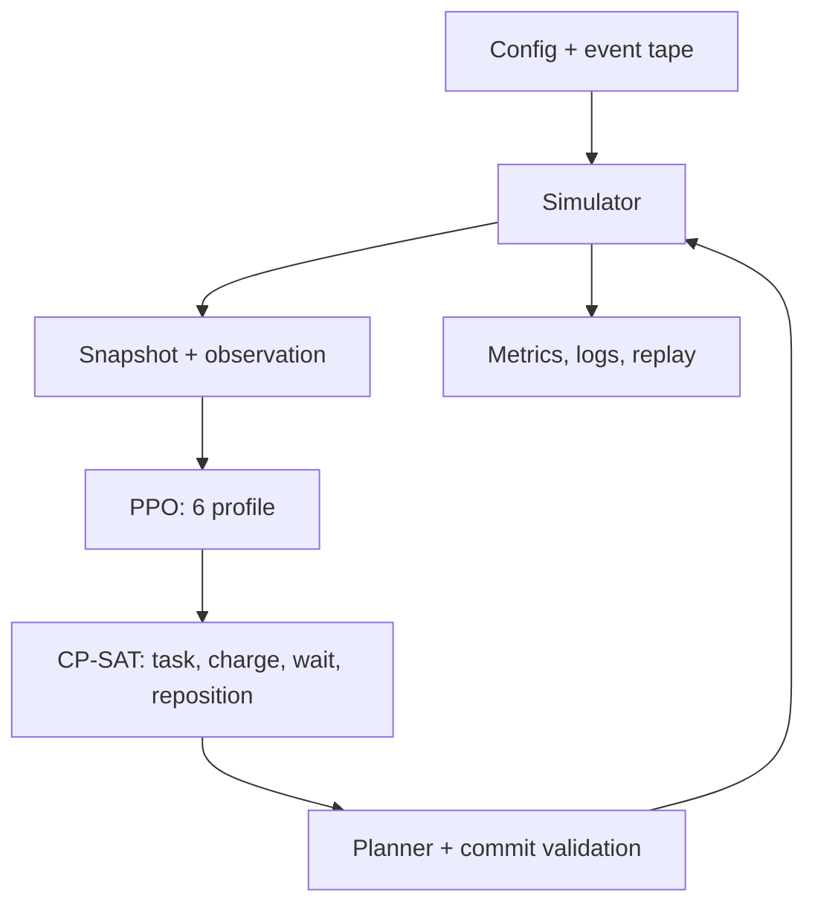

# ABOUT — bản đồ source và hợp đồng kỹ thuật

Tài liệu này dành cho người/agent nhận source để sửa simulator, thay kiến trúc, phân tích một lần train hoặc mở rộng sản phẩm. `README.md` hướng dẫn cài và chạy. Hai file gốc này là điểm bắt đầu; `docs/PROPOSAL.md` giữ nguyên đề xuất và `docs/proposal_traceability.md` đối chiếu phạm vi thực hiện. Đừng dùng phần “kỳ vọng” trong proposal như số liệu thực nghiệm.

## 0. FleetRL v2 — vận hành CPU/GPU và metrics đã chốt

**Quyết định hiện tại: tiếp tục train CPU.** Phần GPU dưới đây là phương án triển khai sau; chưa cài PyTorch CUDA, chưa đổi cấu hình train sang GPU và chưa nghiệm thu GPU. Thông tin phần cứng/phần mềm được kiểm tra ngày **11/09/2026**.

V2 có **14 phương án**, mỗi phương án một file trong [src/fleetrl/methods](src/fleetrl/methods/): **11 learner** và **3 controller không học RL**. Trong 11 learner có 10 phương án dùng mạng neural và một Q-learning dạng bảng. Trainer/checkpoint/inference dùng chung ở `learning/`; MILP ở `optimization/`; study ở `experiments/`. Các mục 1–9 bên dưới giữ inventory v1 và mô tả chi tiết phương án PPO–CP-SAT; các mô tả PPO-only không bao quát toàn bộ v2. Hợp đồng vận hành hiện tại xem phần 0 và [hướng dẫn v2](docs/READY_TO_TRAIN.md).

### 0.1. CPU và môi trường hiện tại

| Thành phần | Cấu hình thực tế / trạng thái |
| --- | --- |
| CPU | Intel Core i5-12450H, 8 nhân vật lý, 12 luồng logic. |
| RAM | Tổng RAM hệ thống đo được 15,7 GiB (xấp xỉ 16 GB); đây là tổng dung lượng, không phải RAM còn trống. |
| GPU có trên máy | NVIDIA GeForce RTX 4050 Laptop GPU, khoảng 6 GB VRAM; hiện chưa dùng để train. |
| Hệ điều hành / Python | Windows 11; Python 3.12.0; môi trường riêng `.venv`. |
| PyTorch / CUDA | `torch==2.6.0+cpu`; `torch.version.cuda=None`; `torch.cuda.is_available()=False`. GPU có mặt nhưng bản PyTorch đang cài không hỗ trợ CUDA. |
| Thư viện RL / solver | Stable-Baselines3 và SB3-Contrib 2.7.0; OR-Tools 9.14.6206, SCIP 9.2.2. |
| Thiết bị train | `TrainConfig.device="cpu"`; YAML không ghi device sẽ kế thừa giá trị này. |
| Song song trong một lần train | Mặc định 2 environment cho các phương án SB3; Q-learning và MAPPO hiện yêu cầu `n_envs=1`. Windows dùng `spawn`. |
| Thread và job | `torch_threads=1`, `solver_workers=1`; study chạy các job tuần tự. `n_envs`, thread PyTorch và worker solver là ba thiết lập khác nhau. |

CPU hiện chạy cả mô phỏng, planner, CP-SAT/SCIP, policy inference và cập nhật mạng. Đây là môi trường đã kiểm chứng; hiệu năng CPU/GPU chưa được đối chiếu. Với PPO không dùng CNN, tài liệu SB3 cũng lưu ý CPU có thể phù hợp và có thể tăng tốc lấy mẫu bằng nhiều environment; kết quả của entity encoder trong FleetRL vẫn phải đo trên workload thật. [Nguồn: SB3 PPO 2.7.0](https://stable-baselines3.readthedocs.io/en/v2.7.0/modules/ppo.html).

Bằng chứng CPU: **160 kiểm thử đạt**, **14/14 phương án chạy được**, 11 learner train 128 bước rồi resume lên 144; **56/56 episode dài 600 s** không ghi nhận safety incident, mất task hoặc lỗi policy; study kiểm đủ các pha với **18/18 episode**. Chi tiết và source hash tại [AUDIT_PRETRAIN.md](reports/AUDIT_PRETRAIN.md). Đây là kiểm chứng thực thi; chưa có kết luận hội tụ hay phương án tốt nhất.

Ngân sách nghiên cứu hiện tại là **11 learner × 3 seed × 300.000 = 9,9 triệu bước**, cộng tuning/search/validation và **1.620 episode test chính + 360 episode OOD đối chứng**. Ngoại suy thô từ smoke cho khoảng 125 giờ train chính; tạm dự trù 7–10 ngày cho cả đợt chạy liên tục. Đây là ước lượng lập kế hoạch, chưa phải ETA đã đo ở cấu hình đầy đủ; cần pilot theo từng phương án để hiệu chỉnh.

### 0.2. Các phương án chạy CPU

| Phương án | Cách chạy / khi dùng | Trạng thái và điều kiện |
| --- | --- | --- |
| CPU-1: cấu hình hiện tại | Một job tại một thời điểm; SB3 dùng 2 environment, Q-learning/MAPPO dùng 1; giữ một worker solver. Dùng cho đợt train trước mắt. | Đã kiểm chứng. Dùng `.venv` và `configs/methods/*.yaml`. |
| CPU-2: tăng số environment | Thử tăng `n_envs` cho SB3, chẳng hạn từ 2 lên 4, nếu việc mô phỏng chiếm nhiều thời gian. Đo fleet steps/s, RAM cả cây tiến trình và wall time. | Chưa benchmark cấu hình 4 environment. Theo dõi RAM/nhiệt và tránh chạy nhiều job tranh CPU; không áp dụng cho Q-learning/MAPPO hiện tại. Đổi `n_envs` còn đổi kích thước rollout, nên phải kiểm lại `n_steps`, batch và số bước thực. |
| CPU-3: máy CPU mạnh hơn | Chuyển sang workstation/server có nhiều nhân và RAM hơn; có thể phân các seed độc lập sang các máy khác nhau. | Là phương án mở rộng. Study runner hiện chưa tự phân phối nhiều máy; cần tổ chức output/job riêng, giữ seed/tape/source/config và ghi rõ phần cứng khi tổng hợp. |

Lệnh CPU hiện dùng, chạy tại thư mục gốc repository; mỗi lần train dùng thư mục output mới:

```powershell
.\.venv\Scripts\python.exe -m fleetrl train --config configs/methods/ppo_cpsat.yaml --device cpu --seed 11 --output runs/ppo_cpu/seed11
# Toàn bộ study: tune, search, train, test, report; giữ cấu hình CPU hiện tại.
.\scripts\train_study.ps1 -Output runs/study14_cpu
```

Đổi tên config để chọn learner khác. Heuristic, fixed CP-SAT và forecast MPC dùng `tune`/`eval`, không gọi train RL. Khi đổi cấu hình/thiết bị để benchmark, dùng output study mới vì study đã chạy khóa source/config/selection; không sửa cấu hình của một study đang dở để trộn kết quả.

### 0.3. Các phương án chạy GPU — chưa triển khai

GPU chỉ áp dụng cho phần mạng neural của **DQN, A2C, PPO, QR-DQN, Recurrent PPO, PPO threshold, SAC, TD3, MAPPO và PPO–MILP**. Q-learning dạng bảng, heuristic, CP-SAT, SCIP/MPC, planner và simulator hiện vẫn chạy CPU. Tăng tốc mạng không đảm bảo tăng tốc tương ứng cho cả pipeline.

| Phương án | Cách triển khai dự kiến | Điểm cần đo / hoàn thiện |
| --- | --- | --- |
| GPU-1: RTX 4050 trên máy hiện tại | Tạo môi trường riêng, ví dụ `.venv-cuda`, cài PyTorch có CUDA rồi chạy mạng trên GPU; environment và solver ở CPU. | Giữ `.venv` CPU làm mốc đối chiếu. Đo lợi ích thực, bộ nhớ GPU và batch phù hợp với 6 GB VRAM; không mặc định GPU nhanh hơn. |
| GPU-2: workstation/server/cloud GPU | Chuyển cùng source và protocol sang máy có GPU, CPU và RAM phù hợp; chạy các training seed độc lập theo khả năng tài nguyên. | Ghi đủ phần cứng, dependency, wall time và chi phí thuê nếu có. Runner hiện tuần tự, chưa có DDP hay điều phối đa GPU; không coi chạy nhiều seed là huấn luyện phân tán một model. |
| GPU-3: train GPU, test/triển khai CPU | Học mạng trên GPU, sau đó nạp checkpoint về CPU để so latency trên cùng nền triển khai với các baseline. | Loader hiện mặc định nạp CPU khi eval/study test; validation trong lúc train dùng model đang học. Cần kiểm save/load qua hai thiết bị và ghi rõ thiết bị của từng pha. |

Để giữ gần môi trường đã kiểm chứng, có thể chuẩn bị CUDA build cùng phiên bản PyTorch 2.6.0 trước khi cân nhắc nâng phiên bản; lựa chọn wheel/runtime phù hợp theo [hướng dẫn chính thức cho các phiên bản PyTorch](https://pytorch.org/get-started/previous-versions/). Dependency lock và báo cáo CUDA phải được lưu riêng sau kiểm chứng.

Ví dụ lệnh **chỉ dùng sau khi đã chuẩn bị và kiểm tra môi trường CUDA**; `.venv-cuda` chưa được tạo trong đợt cập nhật tài liệu này:

```powershell
.\.venv-cuda\Scripts\python.exe -c "import torch; assert torch.cuda.is_available(); print(torch.__version__, torch.cuda.get_device_name(0))"
.\.venv-cuda\Scripts\python.exe -m fleetrl train --config configs/methods/ppo_cpsat.yaml --device cuda --seed 11 --output runs/ppo_gpu/seed11
```

Với cả study, cần bộ config riêng có `train.device: cuda` cho 10 phương án neural, giữ Q-learning CPU và trỏ `study.config_dir` sang bộ config đó; `study` hiện không có cờ `--device`. Cờ `--device cuda` của SB3 có thể rơi về CPU nếu CUDA không khả dụng, nên phải kiểm cả thiết bị thật của tensor/model; chỉ nhìn tên lệnh hoặc sự hiện diện của GPU là chưa đủ.

Trước khi công nhận GPU ready to train, cần bổ sung kiểm thử chọn device cho `ready-check` (hiện kiểm CPU), xác nhận update thật trên CUDA và VRAM, kiểm finite/save/load/resume, Windows spawn và các controls. Riêng MAPPO cần kiểm bổ sung việc lưu/khôi phục CUDA RNG; implementation hiện lưu Torch CPU RNG. Benchmark CPU/GPU phải dùng cùng workload, seed, kiến trúc và ngân sách; đo riêng khởi động, đồng bộ CUDA tại biên đo, và tính cả simulator/solver/checkpoint vào wall time. So latency triển khai trên cùng thiết bị test, không gộp kết quả CPU/GPU thiếu nhãn.

### 0.4. Đầy đủ 16 nhóm metrics đã chốt

**16 nhóm M01–M16**, mỗi nhóm có thể có nhiều chỉ số con. Công thức và tổng hợp thống kê nằm trong [metrics.py](src/fleetrl/metrics.py); bảng khóa/đơn vị/phạm vi đầy đủ tại [metrics_dictionary.md](docs/metrics_dictionary.md). Dùng `N` = số task đã tới, `F` = số hoàn thành, `U=N−F`, `T` = thời gian mô phỏng đã chạy, `P` = số cổng sạc.

| ID | Tên / khóa chính | Vai trò | Mô tả cơ bản và cách đọc |
| --- | --- | --- | --- |
| M01 | Năng suất — `throughput_per_hour` | Đo khả năng phục vụ; cao hơn tốt hơn. | `F/(T/3600)`, đơn/giờ mô phỏng. So các ca có workload/horizon tương ứng. |
| M02 | Hoàn thành và tồn đọng — `completed`, `pending`, `completion_rate`, `pending_rate`, `blocked_tasks` | Phát hiện phương án để lại việc khó. | Báo F, U, F/N và U/N; giữ cả task blocked và task ngoài shortlist. Completion cao, pending thấp là hướng mong muốn. |
| M03 | Tổng trễ — `total_lateness_s` | Đánh giá mức chậm giao, cần giảm. | Tổng `max(0, c*−deadline)`; `c*` là giờ hoàn tất hoặc T nếu chưa xong. Đây là cận dưới cho đơn còn tồn, không phải integral có trọng số priority dùng trong reward. |
| M04 | Vi phạm deadline — `deadline_due`, `deadline_violated`, `deadline_violation_rate` | Đánh giá tỷ lệ vi phạm cam kết. | Mẫu số chỉ gồm task có deadline ≤ T; hoàn thành muộn hoặc vẫn chưa xong đều vi phạm. Báo riêng pending chưa đến hạn. |
| M05 | Chờ lấy hàng — `mean_wait_s`, `wait_censored` | Đo độ trễ từ lúc có đơn đến khi được phục vụ. | Từ giờ tạo tới bắt đầu pickup; task chưa được lấy tính tới T và được đánh dấu censored. Đơn vị giây, hướng giảm. |
| M06 | Năng lượng — `consumed_wh`, `grid_wh`, `energy_per_completed_wh`, `battery_balance_error_wh` | Đánh giá hiệu quả và tính nhất quán vật lý. | Tính tiêu thụ của mọi robot, kể cả đi rỗng/chờ/việc chưa xong; Wh/đơn = consumed/F. Kiểm pin đầu + điện nạp vào pin − tiêu thụ − pin cuối ≈ 0; có số liệu theo loại robot và SoC cuối. |
| M07 | Quãng đường / đi rỗng — `distance_m`, `empty_distance_m`, `loaded_distance_m`, `empty_distance_ratio` | Đo lãng phí di chuyển. | Đếm cạnh đã đi xong, không lấy chiều dài route dự kiến; tỷ lệ = đường rỗng / tổng đường thực. Đọc cùng throughput để tránh đánh giá robot đứng yên là hiệu quả. |
| M08 | Chờ sạc — `mean_charge_wait_s`, `charging_requests`, `charge_wait_censored`, `charge_cancelled` | Đo tắc nghẽn và khả năng tiếp cận sạc. | Từ yêu cầu được chấp nhận tới bắt đầu sạc; chưa bắt đầu thì tới T, yêu cầu hủy thì tới giờ hủy. Giữ và báo các nhóm này thay vì bỏ ca khó. |
| M09 | Sử dụng cổng — `port_usage`, `charger_utilization`, `port_occupied_utilization` | Phân biệt cổng đang nạp với cổng bị chiếm. | Đo thời gian nạp thực, kể cả phần tick, và thời gian robot thực chiếm ô cổng. Utilization từng cổng chia T; toàn đội chia P×T. Cao hơn không luôn tốt: cần đọc cùng thời gian chờ và throughput. |
| M10 | An toàn / tính đúng — `safety_incidents`, `invariant_incidents`, `lost_tasks` | Điều kiện ưu tiên trước hiệu quả, mục tiêu 0 vi phạm. | Audit trạng thái đã thực thi: tải trọng, quyền sở hữu/giao trùng task, pin, mất hàng/task; cộng các counter collision, edge conflict, reserve và emergency. Proposal bị từ chối được báo riêng, không đồng nghĩa đã gây vi phạm. |
| M11 | Deadlock và phục hồi — `deadlock_incident_count`, `deadlock_recovery_rate`, `deadlock_recovery_s`, `deadlock_pending` | Đo số lần kẹt và khả năng thoát kẹt. | Phân biệt tiến triển đầu tiên với phục hồi được xác nhận: tiến triển liên tục 30 s hoặc hoàn tất thao tác. Ca chưa hồi phục tới T vẫn được ghi với thời gian censored. |
| M12 | Độ trễ online — `decision_p50_ms`, `decision_p95_ms`, `decision_max_ms`, `online_budget_exceeded_rate` | Kiểm tra khả năng đáp ứng ngân sách quyết định 250 ms. | Tính snapshot/encode, inference, forecast nếu có, dựng/giải và guard/commit đúng một lần. `latency_components_ms` có các phần đo; `advance_ms` được báo riêng, không cộng vào online latency. |
| M13 | Solver, fallback, rejection — `solver_calls`, `solver_status_counts`, `solver_nonoptimal_rate`, `solver_timeout_rate`, `fallback_rate`, `proposal_rejection_rate` | Đánh giá chất lượng giải và mức phải dùng phương án dự phòng. | Nonoptimal tính theo lượt solve; timeout theo các dispatch có gọi solver và thông tin dừng; fallback theo quyết định, rejection theo số đề xuất. Giữ raw status/lý do. FEASIBLE/UNKNOWN không tự là timeout; không biết thì null. MPC HOLD bình thường khi robot đều bận không là fallback. |
| M14 | Chi phí học và tài nguyên — `resources` trong training manifest | So ngân sách tương tác, thời gian và khả năng chạy trên phần cứng. | Báo bước thực, updates, wall/learning/validation/checkpoint time, steps/s, peak RAM đồng thời của parent+workers; có trường GPU allocated/reserved nếu CUDA khả dụng. CPU time có trong resource samples. Phạm vi là lần train. |
| M15 | Độ ổn định thống kê — `statistics`, `paired_vs_reference` | Đánh giá độ biến động giữa seed và độ chắc chắn của chênh lệch. | Mean, sample SD và CI95 từ bootstrap chéo tape × training seed. Đối chiếu cùng seed/tape với fixed CP-SAT; giữ expected grid và không coi từng tick/checkpoint cùng seed là mẫu độc lập. Thiếu grid hoặc chỉ có một tape thì không xuất CI. |
| M16 | Tổng quát hóa / OOD — `generalization` | Đo thay đổi KPI khi chuyển điều kiện vận hành. | Cặp OOD_A/OOD_B dùng cùng workload để tách ảnh hưởng layout; báo OOD−control và tỷ lệ so với trị tuyệt đối control khi khác 0. S9 là thay đổi kết hợp, không dùng để quy mọi suy giảm cho riêng map. |

Quy tắc đọc và nghiệm thu metrics:

- **M01–M13** thuộc episode; **M14** thuộc training manifest; **M15–M16** thuộc study summary. Một episode không thể tự sinh số liệu thống kê nhiều seed hay kết luận OOD.
- Mẫu số bằng 0 hoặc chưa đo là **`null`**, không thay bằng 0. Task/yêu cầu chưa xong tới T được giữ và đánh dấu censored; crash/partial run vẫn nằm trong coverage, không được trình bày như safety = 0.
- Với M13, `solver_calls` đếm lượt solver thật, `solver_dispatches` đếm quyết định có gọi solver; MILP có thể gọi nhiều lần trong một dispatch. `solver_known_timeout_rate` chỉ dùng nhóm biết cờ timeout; tỷ lệ timeout toàn bộ để null nếu còn ca chưa rõ. Không trộn các mẫu số này.
- Với M14, `learning_s` hiện gộp lấy mẫu và update; chưa có breakdown riêng rollout/update. CPU samples là thời gian CPU tích lũy và RAM cả cây tiến trình. VRAM là bộ nhớ PyTorch allocated/reserved của tiến trình, không phải toàn bộ GPU; bản CPU hiện tại trả null cho VRAM. Bộ đếm updates khác đơn vị giữa các learner, không dùng như số gradient step tương đương.
- Chọn checkpoint bằng validation: ít safety incidents hơn → nhiều completed hơn → ít lateness hơn → ít pending hơn; khi bằng nhau chọn lần đánh giá sau. Test được giữ riêng. Báo hiệu quả cùng safety, latency và tài nguyên; không suy phương án tốt nhất từ một metric hoặc một lần smoke.

## 1. Bài toán và ranh giới trách nhiệm

Trong phương án **PPO–CP-SAT**, một policy PPO tập trung chọn một trong sáu profile chi phí mỗi 5 giây mô phỏng. **CP-SAT** chọn công việc, chờ, chuyển điểm đỗ hoặc sạc; với sạc, solver chọn cả cổng, đích SoC và thời điểm. **Planner** tổ chức di chuyển. **Simulator** sở hữu trạng thái thật và kiểm tra trước khi thực thi. Ở phương án này, robot không có policy riêng và PPO không sinh vận tốc hay điều khiển động cơ; MAPPO trong v2 dùng actor chung cho từng robot và critic tập trung.



Chỉ simulator đọc tape tương lai. Optimizer và policy nhận dữ liệu đã tới; snapshot trễ mang timestamp. Không đưa tổng số đơn của cả tape, thời điểm sự cố tương lai hoặc seed như đặc trưng policy. Mỗi phương pháp trong benchmark dùng cùng tape ngoại sinh và trạng thái ban đầu; tác động của hành động lên trạng thái sau đó được phép khác nhau.

## 2. Đơn vị và dữ liệu chung

- Vị trí: `Cell = tuple[int, int]`, một ô bằng 1 m. Chiều đầu là x, chiều sau là y.
- Thời gian: giây mô phỏng có hậu tố `_s`; tick mặc định 0,5 s, quyết định mặc định 5 s. Thời gian đo thực dùng ms ở `solver_ms`/`total_ms` và không thay đồng hồ mô phỏng.
- Năng lượng: Wh; công suất W; tốc độ m/s; tải kg; SoC là tỷ lệ 0–1.
- ID robot/task/port: số nguyên. Event tape là JSON tuần tự hóa được; mỗi sự kiện có giờ, loại và payload.
- Snapshot chứa các bản sao trạng thái, tách khỏi đối tượng sống. Dataclass `Snapshot` bị đóng băng ở lớp ngoài; không coi các đối tượng lồng bên trong là một cơ chế bảo mật bất biến sâu.

| Kiểu trong `src/fleetrl/types.py` | Nội dung và người sử dụng |
| --- | --- |
| `Robot` | ID, loại, vị trí, dung lượng/pin, tốc độ/tải tối đa, mức tiêu thụ; status, task/port đang giữ, tải thật, route/move/service còn lại, thời gian tạm dừng và metadata. Simulator thay đổi; optimizer đọc bản sao. `soc` là battery_wh/capacity_wh. |
| `Task` | Lấy/trả, tải, giờ tạo/deadline, ưu tiên/vùng; trạng thái, robot, mốc giao/lấy/hoàn tất và lý do blocked. Không xóa khỏi thống kê khi khó hoặc không khả thi. |
| `Port` | ID cổng/trạm, vị trí, công suất, loại robot tương thích và ô chờ. |
| `ChargeBooking` | Robot/cổng, ETA, start/end dự kiến, đích SoC, giờ yêu cầu và mốc thực tế/hủy. Khoảng chiếm cổng và khoảng đợi là hai tài nguyên khác nhau. |
| `GridMap` | Kích thước, tường, pickup/dropoff/parking và các cổng; cung cấp kiểm ô, hàng xóm và vùng. |
| `Snapshot` | Giờ thật/giờ quan sát, version, robots/tasks/ports/bookings, map, ô bị chặn, nhu cầu theo vùng, map_version; `state_hash` phục vụ truy vết. Không chứa tape tương lai. |
| `Decision` | Một thao tác task/charge/reposition/wait; robot, tài nguyên liên quan, đích, ETA/lịch, năng lượng ước tính, reason và metadata. |
| `DecisionPlan` | Snapshot version, profile, danh sách quyết định; solver status/time, total time, fallback, objective và số ứng viên. |
| `ScenarioEvent` | `time_s`, `kind`, `payload`; loại cơ bản task/block/unblock/pause. |
| `EventTape` | Seed, các sự kiện, metadata; đọc/ghi JSON và SHA-256 của nội dung chuẩn hóa. |

`docs/CONTRACTS.md` mô tả API ghép module. Những tên mở rộng trong proposal như `StateSnapshot v1` là ý tưởng thiết kế; tên/field dataclass trong bảng trên và code là hợp đồng chạy thực tế.

### Kho, đội robot và scenario mặc định

Map A/B là lưới 40×30 m; map A có 12 pickup, 4 dropoff, 24 ô đỗ bố trí ở hai mép và 4 cổng thuộc 2 trạm. Hai cổng của một trạm dùng chung 4 ô chờ. Trạm 0 chỉ nhận L/M; trạm 1 nhận L/M/H. Map B đổi kệ/pickup/cổng; S6 đổi vị trí trạm trên map A và giảm công suất còn 300 W. Tải map tùy chỉnh qua `env.map_path`; số cổng tối đa 4 để giữ observation shape.

| Loại | Pin Wh | Tốc độ m/s | Tải kg | Tiêu thụ cơ sở Wh/m |
| --- | ---: | ---: | ---: | ---: |
| L | 180 | 2,0 | 20 | 0,035 |
| M | 300 | 1,0 | 50 | 0,055 |
| H | 450 | 0,75 | 100 | 0,085 |

Mặc định 15 robot gồm 6L/6M/3H; 10 robot gồm 4/4/2; 20 robot gồm 8/8/4. SoC gốc được sample 25–90%; S4 ép 40% đội vào 25–40% để tạo áp lực sạc. Robot initialization và task tape dùng hai RNG stream tách biệt từ cùng seed, để thay controller không thay input ngoại sinh.

Task masses 5/15/40/80 kg có xác suất 0,30/0,25/0,30/0,15; 20% đơn priority 3, còn lại priority 1. Sau initial_tasks, đơn tới theo Poisson từng vùng; burst chỉ nhân cường độ vùng được chọn trong cửa sổ burst_start/end. Deadline tính từ nominal service và quãng đường, không từ kết quả policy. `scenario_config` đặt các override cụ thể; bảng field ở dưới cho toàn bộ cấu hình điều chỉnh được.

| Scenario | Thay đổi chính |
| --- | --- |
| S1 / S2 / S3 | 10 / 15 / 20 robot, nhu cầu thường theo quy mô. |
| S4 | Burst 2× ở vùng B, 40% robot có pin đầu thấp. |
| S5 | Đội 20 robot, tỷ lệ H tăng lên 40%. |
| S6 | Đổi vị trí trạm, giảm công suất cổng xuống 300 W. |
| S7 | Chặn đường và tạm dừng robot. |
| S8 | Snapshot trễ 15 s; kiểm conservative fallback. |
| S9 | Map B, burst 2,5× ở vùng khác, OOD. |

## 3. Observation và action của RL

Gymnasium nhận `Dict` các tensor float32 đã scale theo hằng số vật lý. Mask biểu diễn hàng có mặt, không phải quyền chọn action. Action space là `Discrete(6)` và mọi profile đều hợp lệ; infeasible task/charge candidate bị tầng tối ưu loại.

| Key | Shape cố định | Vai trò |
| --- | --- | --- |
| `robots` / `robot_mask` | `(20, 14)` / `(20,)` | Đội robot thật được padding tới 20. |
| `tasks` / `task_mask` | `(40, 10)` / `(40,)` | Tối đa 40 đơn được chọn để quan sát; các đơn ngoài bảng vẫn ở simulator/reward/KPI. |
| `ports` / `port_mask` | `(4, 6)` / `(4,)` | Trạng thái cổng sạc. |
| `global` | `(40,)` | Giờ còn lại, tổng hợp đội/tồn/sạc, nhu cầu theo vùng và lịch sử. |

Các cột và phép scale được định nghĩa tập trung trong `observations.py`; thay đổi chúng là thay hợp đồng checkpoint. Không tái sử dụng policy cũ chỉ vì shape tình cờ không đổi.

Cột bắt đầu từ 0; `w=width−1`, `h=height−1`, `H=horizon_s`. Cuối encode clip về [-5,5] và kiểm finite; presence mask là 0/1. Giá trị quá lớn bị clip có thể mất thông tin, cần xem counters/KPI gốc khi debug overload.

| Tensor | Cột / ý nghĩa theo đúng thứ tự |
| --- | --- |
| `robots` | 0 x/w; 1 y/h; 2 SoC; 3 speed/2; 4 payload_capacity/100; 5 capacity_wh/450; 6 movement_wh_m/0,085; 7 load/payload_capacity; 8 status_index/13; 9 target_soc hoặc 0; 10 (move_remaining+service_remaining)/H; 11 observation_age/15; 12 zone/3; 13 có task. |
| `tasks` | 0 pickup_x/w; 1 pickup_y/h; 2 dropoff_x/w; 3 dropoff_y/h; 4 kg/100; 5 age/H; 6 deadline_slack/H; 7 priority/3; 8 zone/3; 9 tỷ lệ robot đủ tải. Không đưa ID task/robot vào network. |
| `ports` | 0 x/w; 1 y/h; 2 power/600; 3 thời gian tới booking kết thúc xa nhất/900; 4 số booking chưa bắt đầu/4; 5 tương thích H. |
| `global[0:8]` | 0 thời gian đã trôi/H (còn lại=1−giá trị); 1 số robot/20; 2 arrived/200; 3 completed/200; 4 pending/40; 5 robot có task/20; 6 tổng tuổi pending/(40H); 7 tổng trễ pending/(40H). |
| `global[8:16]` | 8 robot SoC<0,3 /20; 9 idle/20; 10 SoC trung bình; 11 SoC thấp nhất; 12 công suất cổng trung bình/600; 13 cờ map B; 14 tuổi snapshot/15; 15 số ô bị chặn/10. |
| `global[16:28]` | 16–19 số đơn tới 60 s qua từng vùng/10; 20–23 pending từng vùng/40; 24–27 robot từng vùng/20. |
| `global[28:40]` | 28–31 tổng đơn tới trong cửa sổ cộng dồn 60/120/180/240 s qua, mỗi số chia40; 32–35 pending tải5/15/40/80kg /40; 36–39 pending ưu tiên3 từng vùng/40. |

Task shortlist: một nửa là đơn già nhất; phần còn lại ưu tiên priority/deadline, rồi toàn bảng được sort deadline/age/ID. Có thể bao gồm đơn đã giao nhưng chưa hoàn tất. Các task ngoài 40 hàng vẫn ảnh hưởng global aggregates, reward và KPI. Robot sort ID chỉ để snapshot/log ổn định; entity pooling không dùng ID làm đặc trưng.

Thứ tự mã status: `idle`, `to_pickup`, `pickup`, `to_dropoff`, `dropoff`, `to_charge_queue`, `waiting_charge`, `to_charge_port`, `docking`, `charging`, `charge_egress`, `reposition`, `recovering`, `hold`. Mã vô danh rơi vào hàng cuối; không coi scalar status là một quan hệ vật lý có thứ bậc. Nếu đổi sang one-hot, phải đổi shape/encoder/checkpoint và chạy lại learning experiment.


| ID / tên trong `optimizer.PROFILES` | wT trễ | wG tích pin | wA sẵn sàng | wZ cân vùng | wE năng lượng |
| --- | ---: | ---: | ---: | ---: | ---: |
| 0 `balanced` | 1 | 1 | 1 | 1 | 0,2 |
| 1 `deadline` | 3 | 0,5 | 1 | 1 | 0,2 |
| 2 `store_energy` | 1 | 3 | 0,5 | 1 | 0,2 |
| 3 `keep_available` | 1 | 0,5 | 3 | 1 | 0,2 |
| 4 `reduce_empty_travel` | 1 | 1 | 1 | 1 | 1 |
| 5 `balance_zones` | 1 | 1 | 1 | 3 | 0,2 |

Profile chỉ đổi mục tiêu mềm. Không profile nào được tắt kiểm tải, pin, độc quyền task, cổng hoặc kiểm chuyển động. `validate_profile()` đưa NaN, số không nguyên hay ID ngoài miền về profile 0 và ghi lý do; đây là fallback có thể quan sát, không phải kết quả suy luận hợp lệ của policy.

### Tối ưu joint và các hiệu chỉnh so proposal

`FleetOptimizer.generate_candidates()` tạo lựa chọn riêng cho robot rảnh: task đủ tải/pin, sạc tới cổng tương thích, reposition tới parking hoặc wait. Shortlist task bảo vệ đơn gấp/già và xoay phần còn lại theo robot ID để mọi robot không cùng nhìn đúng sáu task đầu tiên. Một robot chọn đúng một ứng viên; một task và một điểm đỗ có tối đa một robot chọn. CP-SAT dùng optional charging intervals với NoOverlap theo cổng và Cumulative cho khoảng chờ theo trạm. Start đặt trên lưới decision_s; thời điểm kết thúc không bị cắt ở charging_horizon_s. Solver dùng một worker, hint từ heuristic và tắt presolve theo phép đo tích hợp; trạng thái FEASIBLE có nghiệm dùng được nhưng chưa chứng minh optimal. Trong v2, FEASIBLE/UNKNOWN không tự xác định timeout; `timed_out` để null khi không biết nguyên nhân dừng, còn trạng thái chưa optimal được báo riêng trong M13.

Chi phí cộng của mỗi ứng viên là `(-4×is_task + wT×tardiness/600 + wE×energy/100 + 0,3×duration/900 − wG×useful_gain/100) / N`. N là toàn bộ số robot. Chi phí chờ sạc và slack thiếu lực lượng/cân vùng cũng chuẩn hóa theo N. **Mọi thành phần cộng đều chia cho quy mô đội** để tránh chỉ thưởng giao việc/N nhưng thưởng tích pin nguyên tổng, khiến đội lớn đồng loạt sạc. Hệ số chi phí được nhân **1.000.000** khi đưa vào CP-SAT, thay vì 1.000 trong proposal, để không làm tròn mất chi phí nhỏ theo tick/robot.

Tardiness của ứng viên dùng phần trễ tăng thêm sau thời điểm hiện tại, trừ pressure theo tuổi/deadline, có trọng số ưu tiên. Trừ trễ đã xảy ra giúp đơn quá hạn không trở thành việc “làm gì cũng đắt” rồi bị để lại mãi. Đây là surrogate có chủ đích, khác tổng tardiness thật dùng báo cáo. Readiness dùng nhu cầu 60 s đã qua và thời gian từ giao đến hoàn tất của các task kết thúc trong cửa sổ 60 s; nếu chưa có task hoàn tất thì dùng 120 s. Backlog đang chờ là cận dưới cho nhu cầu lực lượng. Proxy/cửa sổ này vẫn cần calibration.

Năng lượng tăng tới 80% được tính đủ; phần từ 80% tới 95% chỉ có giá trị 0,3 lần trong objective. Ứng viên sạc phải tăng tối thiểu 5% dung lượng để tránh chu kỳ sạc rất nhỏ như 79,9→80%. Độ khẩn năng lượng xét đi tới cổng + reserve + dự trù 300 s chờ đường + max(300 s chờ cổng, lịch mở hiện có), kèm buffer can thiệp 10% dung lượng. Robot rảnh thuộc diện khẩn ngừng nhận task/reposition; sạc chủ động của robot khỏe nhường trước cho chúng. Với advanced charging, lượt khẩn ưu tiên hồi tới 60% để nhả cổng; B0/A theo ngưỡng vẫn dùng 95%. Các guard này giống nhau ở B1/H và không sửa reward RL. Khi lập ứng viên sạc, `arrival_s` ban đầu là ETA sớm nhất tới ô chờ; earliest port start dùng đường qua các ô chờ có thể chọn, không dùng shortcut thẳng tới cổng. Energy admission cũng tính hành trình qua queue. Lịch dùng margin `min(30 s, 10% charger_wait_bound_s)` — mặc định plan tối đa 270 s chờ, physical guard vẫn 300 s. Nếu calendar repair đã dự đoán chờ quá giới hạn, booking được hủy có reason và robot thử rút về ô đỗ; booking hủy vẫn nằm trong lịch sử/KPI.

Khi kiểm task, solver tìm **bằng chứng có slot về sạc theo calendar hiện tại**, không đặt trước một cổng vĩnh viễn cho task đó. Các quyết định online sau đó có thể thay calendar; simulator phải recheck và ghi sự cố nếu giả định mất hiệu lực.

### Di chuyển, hàng chờ điểm phục vụ và can thiệp

`ReservationTable` giữ cả ô gốc và ô đích trong suốt một lần đi cạnh, chặn chung ô và đổi chỗ đối đầu. `GridPlanner.corridors` phát hiện chuỗi ô bậc 2 giữa junction/dead-end; `corridor_move_allowed` giới hạn một chiều di chuyển khi corridor đang có robot. Robot dừng ở trong corridor giữ chỗ; robot mới chờ nếu chưa biết chiều đi. Quyền được suy từ occupancy và pending moves, tự nhả khi corridor trống, không dùng token có thể bị quên nhả.

Static route dùng reverse BFS cache và đường vòng có A*. Khi contention, timed A* xét tối đa 60 s rồi thực thi/kiểm lại từng cạnh; prefix đường vòng được giữ qua các tick để tránh quay lại static route và lắc qua lại. **Không commit nguyên tử cả route 5 s của toàn đội** như thiết kế mạnh hơn trong proposal. Admission task/booking và execution guard vẫn tách khỏi PPO; bảo đảm cục bộ của reservation không phải bằng chứng tồn tại đường đi toàn cục.

Pickup/dropoff có endpoint lease: chỉ một robot tiếp cận cuối, các robot khác đợi ngoài vùng tiếp cận; idle blocker có thể được đẩy sang parking để nhả endpoint. Đây là hàng chờ dịch vụ có quản lý, khác deadlock không tiến triển. Mọi route wait vẫn tính vào giới hạn cấu hình; nếu vượt giả định, ghi energy_emergency và can thiệp.

Khi lỗi năng lượng, simulator giữ hàng đã lấy, trả task chưa lấy về backlog, hủy booking tương lai phù hợp và thử di chuyển vật lý về ô đỗ có đủ pin; nếu không thể thì HOLD tại vị trí. Chỉ ở recovery khẩn mới được dùng phần dự phòng còn lại để rút về ô đỗ; việc đó đã mang cờ vi phạm/can thiệp, không được gọi là kế hoạch bình thường thành công. `emergency_parking` hiện ánh xạ về mã cuối trong observation status; xem metadata/event log để phân biệt nguyên nhân.

## 4. Kiến trúc PPO và ý nghĩa checkpoint

Bản tham chiếu của proposal là flatten observation+mask rồi actor/critic MLP riêng, mỗi nhánh 2 lớp 128 tanh. Bản entity dùng một MLP dùng chung trọng số cho từng loại hàng robot/task/port, 64 chiều; gộp masked mean, masked max và attention có query từ global context. Global context có encoder riêng. Fusion 256 chiều đi vào hai nhánh actor/critic 2×128. Actor cho phân phối categorical 6 action; critic cho một giá trị trạng thái.

Cấu hình observation hiện tại cho bản `entities` khoảng **294.343 tham số** (manifest ghi số thực của từng run). Entity encoder giảm phụ thuộc vào thứ tự hàng tùy ý và cho phép tập trung vào đơn gấp/robot ít pin. Attention này không phải giải thích nhân quả của policy. Không có GNN, Transformer stack hay recurrent state. Tăng độ sâu không tự giải quyết reward sai, action không ảnh hưởng được kế hoạch hoặc planner bị bế tắc. Giữ bản MLP để so bằng cùng ngân sách tương tác; chi phí đồng hồ thực cũng phải báo riêng.

Thông số khởi điểm: learning rate 3e-4, gamma 0,995, GAE 0,95, PPO clip 0,2, rollout 1.024 bước/env, batch 256; entropy, KL target, số epoch, clipping gradient và value coefficient nằm trong `TrainConfig`. SB3 thực hiện PPO/GAE, rollout buffer, tối ưu và serialize. Không dùng `VecNormalize`: observation scale cố định và advantage được chuẩn hóa trong PPO, nên không có file normalization bị quên khi nạp model.

Một checkpoint SB3 lưu actor, critic, optimizer state và bộ đếm PPO. Resume tiếp tục học từ trạng thái đó nhưng bắt đầu lại episode/rollout trong môi trường mới; không hứa tái hiện từng bit như một tiến trình chưa từng dừng. `best_model.zip` chọn bằng validation với thứ tự so sánh: ít sự kiện vi phạm hơn → nhiều đơn hoàn tất hơn → tổng trễ thấp hơn → ít đơn tồn hơn; không chọn bằng reward đơn lẻ. `final_model.zip` là model cuối cùng. Policy khởi tạo hoặc policy resume được đánh giá trước và có thể vẫn giữ vị trí best nếu các update làm tệ đi. Test giữ riêng không được dùng chọn checkpoint hay tune.

Tên encoder trong YAML/CLI là `entities` hoặc `mlp`. Khi bật curriculum và budget đủ ít nhất ba rollout, 15% budget dùng warmup ≤5 robot, demand giảm theo tỷ lệ đội rồi nhân 0,7, không burst/sự cố; 25% dùng ≤10 robot, demand theo tỷ lệ đội rồi nhân 0,9, không sự cố; 60% còn lại dùng stage đích có trộn episode:10/15/20 robot × demand factors0,7/1,0/1,3; demand=base_demand×N/base_N×factor. Mỗi stage làm tròn lên rollout đầy đủ nên số timesteps thực có thể cao hơn yêu cầu. Validation luôn chạy đúng cấu hình đích gốc. Resume không lặp warmup/intermediate nhưng vẫn có thể trộn target variants nếu curriculum bật; `--no-curriculum` tắt việc trộn này. Cần một output directory mới. Variant được chọn độc lập với seed tape; monitor CSV ghi seed episode, số robot và demand thật, stage manifest ghi `episode_mixing` và `variants`. Encoder không được âm thầm đổi khi resume.

Đọc `docs/rl_architecture.md` để xem cơ sở thuật toán, nguồn chính thức và thiết kế ablation. Smoke test chỉ xác minh đường dữ liệu, update, save/load và evaluate hoạt động; không chứng minh RL hơn optimizer.

## 5. Năng lượng, sạc và reward

Với quãng đường d, thời gian dt, tải m và tải tối đa Q:

`E = movement_wh_m × (1 + load_factor × m/Q) × d + auxiliary_power_w × dt / 3600`.

Ở cấu hình gốc, load_factor=0,5 và auxiliary_power_w=12 W. Di chuyển mỗi cạnh được làm tròn lên tick; phụ tải nền được tính một lần. Dự phòng bằng reserve_soc×capacity_wh, mặc định 10%. Năng lượng cần cho task phải tính cả đi lấy, chở hàng, xử lý, tới cổng tương thích, dự trù chờ đường/chờ sạc và dự phòng. Khi không chứng minh đủ, không ép nhận việc.

Sạc có hiệu suất 90%, công suất cổng 600 W dưới 80% SoC và giảm một nửa trên 80%. Công suất nạp **ròng** đã trừ phụ tải nền. `charge_duration` loại docking, caller cộng thời gian vào/ra cổng. Ba đích mặc định 60/80/95%; một booking có thể kết thúc sau cửa sổ lập lịch vì cửa sổ chỉ chặn thời điểm bắt đầu. Nạp sớm tới đích phải nhả phần lịch dư.

Reward mỗi decision bám proposal:

`r = C − 0,2 × Q/40 − 0,4 × L/40 − 0,02 × E/10 − 10 × V`.

C là số đơn hoàn tất trong bước; Q/L là tích phân backlog và overdue có trọng số ưu tiên theo tick, chia độ dài decision; hai penalty này nhân thêm dt/5 nếu thời lượng decision khác 5 s; E là Wh tiêu thụ; V là vi phạm mới. Kết ca trừ thêm `U/40 + D/600`, với U gồm mọi đơn chưa xong và D là tổng giây trễ quan sát tới cuối ca. Các trọng số tương ứng cấu hình `reward_*`; các thành phần thực tế được trả trong `info['reward_components']` và lưu log.

Horizon 3.600 s là kết thúc hữu hạn của bài toán, có giờ còn lại trong observation và kết ca trả `terminated=True`. Đừng thay nó thành time-limit truncation để bootstrap qua một ca đã kết thúc. Không kéo dài episode tới khi hết backlog để làm đẹp throughput/trễ.

## 6. Quy tắc sửa code và debug

1. **Lỗi invariant trước lỗi learning.** Kiểm collision/edge conflict, assignment trùng, pin âm, thiếu task, booking chồng. Không “chữa” lỗi simulator bằng tăng reward penalty.
2. **KPI gồm đơn khó.** Đơn blocked/quá tải/chưa xong vẫn trong tổng arrived/pending. Thời gian trễ/chờ của đơn chưa xong là quan sát censored tới hết ca; không gọi đó là thời gian hoàn tất thật.
3. **Một chủ sở hữu trạng thái.** Optimizer không sửa robot/task sống. Mọi plan phải đi qua `Simulator.submit_plan`; không gán task trực tiếp từ UI hoặc PPO.
4. **Không thay cam kết đang mang hàng để tăng điểm.** Sự cố được simulator xử lý và log; không hỗ trợ chuyển hàng giữa robot.
5. **Không rò dữ liệu.** Train 0–199; validation từ 1.000; test từ 2.000. Map B là holdout trong protocol mặc định. Tune chỉ validation, rồi đóng config/checkpoint trước benchmark.
6. **Timeout là dữ liệu.** Không đọc nghiệm CP-SAT khi chưa FEASIBLE/OPTIMAL. Fallback/HOLD và lý do phải ở report; benchmark ghép tape không bảo đảm solver tìm cùng nghiệm khi máy có deadline khác nhau.
7. **Giữ bằng chứng.** Sửa reward, map, profile hoặc năng lượng phải đổi config/source hash, chạy lại test liên quan và tạo run mới. Không sửa CSV kết quả bằng tay.

Khi kết quả xấu, theo dõi cùng lúc completed, pending, tardiness, nhóm tải/ưu tiên, energy và charge wait. Nếu action thay đổi nhưng plan gần như không đổi, đánh giá candidate/objective trước khi tăng network. Nếu policy entropy sụp sớm, xem approximate KL/clip fraction, rollout size, learning rate và entropy coefficient. Nếu value explained variance xấu, xem reward components và thời gian credit assignment. So fixed profiles/random profile, MLP/entity và ablation sạc bằng cùng tape/budget.

Phần inventory bên dưới được tạo từ AST của source tại thời điểm bàn giao; private helper cũng được liệt kê để agent tìm được đúng điểm sửa.


<!-- GENERATED_INVENTORY -->

## 7. Bản đồ file và inventory function

| File | Sở hữu trách nhiệm |
| --- | --- |
| `src/fleetrl/__init__.py` | Metadata package/version. |
| `src/fleetrl/__main__.py` | Điểm vào python -m fleetrl; chuyển cho CLI. |
| `src/fleetrl/cli.py` | Parse subcommand/options, doctor/smoke/train/eval/benchmark/UI/tuning và điều phối module. |
| `src/fleetrl/config.py` | Dataclass cấu hình, kiểm key/range, đọc/ghi YAML. |
| `src/fleetrl/energy.py` | Thời gian di chuyển, tiêu thụ Wh, reserve và sạc hai đoạn. |
| `src/fleetrl/env.py` | Gymnasium reset/step: snapshot→optimizer→guarded commit→advance→reward/metrics. |
| `src/fleetrl/evaluation.py` | Episode/benchmark ghép tape, JSONL/replay, manifest/hash, SQLite, bootstrap CI và chart. |
| `src/fleetrl/maps.py` | Tạo map A/B hoặc tải JSON, validation, BFS/distance, lưu map. |
| `src/fleetrl/metrics.py` | KPI có censoring, safety/energy/deadline/group metrics và latency. |
| `src/fleetrl/observations.py` | Observation space cố định, shortlist/mask và feature scaling. |
| `src/fleetrl/optimizer.py` | Sinh/lọc ứng viên; 6 profile; CP-SAT task+charge+reposition+wait; heuristic fallback. |
| `src/fleetrl/planner.py` | Shortest/time-space path và reservation vật lý ô/cạnh. |
| `src/fleetrl/rl.py` | Entity encoder, PPO factory/training, curriculum mixing, validation checkpoint, load/resume/evaluate. |
| `src/fleetrl/scenario.py` | Khởi tạo 3 loại robot, sinh task/sự cố Poisson, event tape, 9 scenario. |
| `src/fleetrl/simulator.py` | Trạng thái sống, event/tick, nhận plan, task/service/charge lifecycle, recovery, occupancy audit. |
| `src/fleetrl/types.py` | Schema chung robot/task/port/snapshot/plan/tape. |
| `src/fleetrl/ui.py` | Pygame dashboard LIVE/REPLAY, control, render và sự kiện demo ghi tape. |
| `scripts/train_seeds.py` | Chạy train tuần tự cho nhiều seed bằng subprocess cùng Python; flag ablation; dừng nếu có run lỗi. |
| `configs/train.yaml`, `train_20.yaml`, `mlp.yaml`, `smoke.yaml` | Preset tham chiếu, 20 robot, MLP ablation và pipeline nhỏ. |
| `requirements.txt` | Khóa dependency trực tiếp đã kiểm, cài package editable và pytest. |
| `pyproject.toml` | Metadata package, dải dependency, entrypoint fleetrl, pytest marker/config. |
| `reports/VERIFICATION.md`, `smoke_report.json`, `acceptance.json`, `junit.xml` | Kết quả kiểm chứng cuối, cấu hình/seed/horizon và giới hạn; xem tên đầy đủ bên trong thư mục reports. |
| `reports/environment-linux-py312.txt` | Full freeze môi trường chạy kiểm chứng; bằng chứng Linux, không phải lock cài Windows. |
| `docs/PROPOSAL.md` | Proposal gốc; phân biệt mục tiêu/ước lượng với kết quả. |
| `docs/CONTRACTS.md` | Hợp đồng ghép các module. |
| `docs/rl_architecture.md` | Lý do PPO/entity architecture, tài liệu nguồn, protocol/giới hạn. |
| `docs/proposal_traceability.md` | Mapping F01–F23, thay đổi thiết kế có chủ đích và giới hạn thực nghiệm. |

### Nên sửa ở đâu trước?

| Tình huống | Điểm vào và test gần nhất |
| --- | --- |
| Sai tải/pin/đơn giao trùng | `optimizer._task_candidate`, `Simulator._task_required_energy`, `Simulator.submit_plan`; test_optimizer/test_simulator. |
| Cổng chồng lịch, tới trễ, queue/egress | optimizer charge/model; Simulator._valid_charge/_admit_charge/_refresh_bookings/_charge/_release_port; test_simulator. |
| Tắc/đi xuyên nhau | `ReservationTable`, `GridPlanner.timed_path`, Simulator._move/_recover_deadlock/_audit_positions; test_planner/test_simulator. |
| Observation/mask/leakage | observations.py, Simulator.snapshot, SeededTrainingEnv.reset; test_rl và env/simulator tests. |
| Reward/KPI | env.step, Simulator._tick tích phân backlog, metrics.fleet_metrics; kiểm cả terminal và censored task. |
| PPO NaN/resume/best sai | rl.ensure_finite_parameters/train, ValidationCheckpointCallback/validation_rank; test_rl. |
| Benchmark pairing/CI/hash sai | evaluation.benchmark/paired_summary/_paired_ci/RunRecorder; test_evaluation. |
| GUI/replay sai frame hoặc sự kiện | ui.Dashboard/run_ui/inject_demo_event, evaluation.snapshot_record/load_replay; test_evaluation. |

### `src/fleetrl/__init__.py`

| Symbol | Vai trò / hợp đồng gần nhất |
| --- | --- |
| — | Module metadata hoặc entrypoint, không định nghĩa function/class riêng. |

### `src/fleetrl/__main__.py`

| Symbol | Vai trò / hợp đồng gần nhất |
| --- | --- |
| — | Module metadata hoặc entrypoint, không định nghĩa function/class riêng. |

### `src/fleetrl/cli.py`

| Symbol | Vai trò / hợp đồng gần nhất |
| --- | --- |
| `_json` (function) | Helper nội bộ; được gọi theo luồng module ở phần trên. |
| `_csv_int` (function) | Helper nội bộ; được gọi theo luồng module ở phần trên. |
| `_csv_str` (function) | Helper nội bộ; được gọi theo luồng module ở phần trên. |
| `doctor` (function) | Import real dependencies, check torch device, no model downloads. |
| `run_smoke` (function) | Run real model checks, 10/15/20 rollout, PPO update/save/load/resume; raise on failure. |
| `run_smoke.mark` (function) | API/helper theo hợp đồng module; tên symbol này là điểm tìm trong source. |
| `tune_baselines` (function) | Validation-only fixed-profile/threshold sweep, never trains or tunes on test. |
| `build_parser` (function) | API/helper theo hợp đồng module; tên symbol này là điểm tìm trong source. |
| `build_parser.common` (function) | API/helper theo hợp đồng module; tên symbol này là điểm tìm trong source. |
| `main` (function) | API/helper theo hợp đồng module; tên symbol này là điểm tìm trong source. |

### `src/fleetrl/config.py`

| Symbol | Vai trò / hợp đồng gần nhất |
| --- | --- |
| `FleetConfig` (class) | Class/schema; xem fields ở phần2 và các method trong cùng module. |
| `FleetConfig.validate` (function) | Từ chối cấu hình thời gian, năng lượng, kích thước hoặc controller không hợp lệ. |
| `FleetConfig.copy` (function) | Copy dataclass với override rồi validate. |
| `FleetConfig.to_dict` (function) | Serialize config thành dict. |
| `TrainConfig` (class) | Class/schema; xem fields ở phần2 và các method trong cùng module. |
| `TrainConfig.validate` (function) | Kiểm encoder, rollout/batch/seed separation/curriculum fields. |
| `load_config` (function) | API/helper theo hợp đồng module; tên symbol này là điểm tìm trong source. |
| `save_config` (function) | API/helper theo hợp đồng module; tên symbol này là điểm tìm trong source. |

### `src/fleetrl/energy.py`

| Symbol | Vai trò / hợp đồng gần nhất |
| --- | --- |
| `reserve_wh` (function) | API/helper theo hợp đồng module; tên symbol này là điểm tìm trong source. |
| `travel_time` (function) | Per 1m edge rounding preserves discrete simulator speed semantics. |
| `energy_for` (function) | API/helper theo hợp đồng module; tên symbol này là điểm tìm trong source. |
| `charge_duration` (function) | Net battery charging time, rounded to tick; docking is separate. |
| `charge_step` (function) | Return (net battery Wh, grid Wh) without mutating robot. Split at80%. |

### `src/fleetrl/env.py`

| Symbol | Vai trò / hợp đồng gần nhất |
| --- | --- |
| `FleetEnv` (class) | Class/schema; xem fields ở phần2 và các method trong cùng module. |
| `FleetEnv.__init__` (function) | Khởi tạo instance và trạng thái nội bộ. |
| `FleetEnv.reset` (function) | Khởi tạo episode/seed/tape; xóa log; ghi pin đầu; trả Dict observation và reset info. |
| `FleetEnv.snapshot` (function) | Lấy snapshot với observation delay đã cấu hình. |
| `FleetEnv.step` (function) | Validate profile, solve, commit, đo online time, advance, tích phân reward và terminal metrics. |
| `FleetEnv.metrics` (function) | Tính fleet KPI trên toàn bộ task và decision log. |
| `FleetEnv.render` (function) | Render snapshot thật thành RGB qua ui.render_frame. |
| `FleetEnv.close` (function) | Dọn tài nguyên/state render liên quan. |

### `src/fleetrl/evaluation.py`

| Symbol | Vai trò / hợp đồng gần nhất |
| --- | --- |
| `serializable` (function) | Convert dataclasses/NumPy/sets to strict JSON; non-finite metrics are null. |
| `write_json` (function) | Write strict UTF-8 JSON, creating parent directories. |
| `method_config` (function) | Apply the proposal's baseline/full/charging-ablation definitions. |
| `choose_action` (function) | Deterministic policy inference with explicit conservative failure records. |
| `account_policy_latency` (function) | Include policy inference in online decision latency and fallback statistics. |
| `file_sha256` (function) | Hash a file incrementally, including large checkpoints. |
| `source_tree_hash` (function) | Identify unpacked Python sources even when no git metadata is present. |
| `object_hash` (function) | API/helper theo hợp đồng module; tên symbol này là điểm tìm trong source. |
| `snapshot_record` (function) | Serialize a replay frame without exposing future tape events to a policy. |
| `runtime_manifest` (function) | Record versions and source revision if the unpacked tree is a git checkout. |
| `RunRecorder` (class) | Append decisions and compressed snapshots; index complete runs in SQLite. |
| `RunRecorder.__init__` (function) | Khởi tạo instance và trạng thái nội bộ. |
| `RunRecorder._line` (function) | Helper nội bộ; được gọi theo luồng module ở phần trên. |
| `RunRecorder.record` (function) | API/helper theo hợp đồng module; tên symbol này là điểm tìm trong source. |
| `RunRecorder.close` (function) | Đóng stream, ghi final metrics/tape/manifest/hash và cập nhật SQLite complete/partial. |
| `load_replay` (function) | Read a recorded session; reject unknown schema and decreasing timestamps. |
| `run_episode` (function) | Evaluate one complete episode, optionally writing its evidence bundle. |
| `_metric_keys` (function) | Helper nội bộ; được gọi theo luồng module ở phần trên. |
| `_finite` (function) | Helper nội bộ; được gọi theo luồng module ở phần trên. |
| `_paired_ci` (function) | Helper nội bộ; được gọi theo luồng module ở phần trên. |
| `paired_summary` (function) | Summarize each scenario/method and paired differences against B1. |
| `_checkpoint_seed` (function) | Helper nội bộ; được gọi theo luồng module ở phần trên. |
| `benchmark` (function) | Run methods on the exact same immutable tape and seed within each case. |
| `plot_benchmark` (function) | Plot mean episode KPIs by scenario; no hidden cross-scenario averaging. |

### `src/fleetrl/maps.py`

| Symbol | Vai trò / hợp đồng gần nhất |
| --- | --- |
| `make_map` (function) | API/helper theo hợp đồng module; tên symbol này là điểm tìm trong source. |
| `validate_map` (function) | API/helper theo hợp đồng module; tên symbol này là điểm tìm trong source. |
| `_bfs` (function) | Helper nội bộ; được gọi theo luồng module ở phần trên. |
| `shortest_path` (function) | API/helper theo hợp đồng module; tên symbol này là điểm tìm trong source. |
| `distance` (function) | API/helper theo hợp đồng module; tên symbol này là điểm tìm trong source. |
| `save_map` (function) | API/helper theo hợp đồng module; tên symbol này là điểm tìm trong source. |
| `load_map` (function) | API/helper theo hợp đồng module; tên symbol này là điểm tìm trong source. |

### `src/fleetrl/metrics.py`

| Symbol | Vai trò / hợp đồng gần nhất |
| --- | --- |
| `fleet_metrics` (function) | API/helper theo hợp đồng module; tên symbol này là điểm tìm trong source. |

### `src/fleetrl/observations.py`

| Symbol | Vai trò / hợp đồng gần nhất |
| --- | --- |
| `observation_space` (function) | API/helper theo hợp đồng module; tên symbol này là điểm tìm trong source. |
| `observation_space.box` (function) | API/helper theo hợp đồng module; tên symbol này là điểm tìm trong source. |
| `select_tasks` (function) | API/helper theo hợp đồng module; tên symbol này là điểm tìm trong source. |
| `encode_observation` (function) | API/helper theo hợp đồng module; tên symbol này là điểm tìm trong source. |

### `src/fleetrl/optimizer.py`

| Symbol | Vai trò / hợp đồng gần nhất |
| --- | --- |
| `ObjectiveProfile` (class) | Fixed, auditable cost multipliers controlled by Discrete(6). |
| `validate_profile` (function) | Reject NaN, non-integer and out-of-range policy actions safely. |
| `earliest_slot` (function) | Find a start without clipping interval tails to the start horizon. |
| `queue_fits` (function) | Check a proposed [arrival,start) against a station queue sweep line. |
| `Candidate` (class) | An eligible operation and its physical estimates before CP-SAT selection. |
| `FleetOptimizer` (class) | Bounded rolling optimizer used identically by fixed-profile B1 and PPO. |
| `FleetOptimizer.__init__` (function) | Khởi tạo instance và trạng thái nội bộ. |
| `FleetOptimizer._reject` (function) | Đếm reason code khi loại ứng viên. |
| `FleetOptimizer._distance` (function) | Tra khoảng cách thật theo geometry và ô chặn từ snapshot; cache theo map. |
| `FleetOptimizer._ticks` (function) | Làm tròn giây lên số tick nguyên. |
| `FleetOptimizer._calendars` (function) | Dựng lịch cổng và khoảng queue từ các booking hiện có. |
| `FleetOptimizer._queue_capacity` (function) | Số ô queue vật lý duy nhất trong station. |
| `FleetOptimizer._energy_urgent` (function) | Nhận diện robot cần sạc khẩn theo travel/reserve/calendar/wait và buffer trước admission task. |
| `FleetOptimizer._task_candidate` (function) | Lọc tải/route/pin/return calendar; tính năng lượng, incremental lateness và deferral pressure. |
| `FleetOptimizer._charge_candidates` (function) | Tạo cổng/đích SoC/lịch ứng viên, thời lượng có docking và useful energy gain. |
| `FleetOptimizer.generate_candidates` (function) | Filter physical eligibility once, independently of the selected profile. |
| `FleetOptimizer._candidate_cost` (function) | Tính surrogate theo profile; mọi thành phần cộng chuẩn hóa theo fleet size. |
| `FleetOptimizer._hold` (function) | Plan wait bảo thủ kèm fallback reason. |
| `FleetOptimizer._heuristic` (function) | Baseline/fallback dùng ứng viên cùng kiểm vật lý, xét task ưu tiên và sạc khẩn. |
| `FleetOptimizer.decide` (function) | Return a feasible proposal or explicit bounded conservative fallback. |

### `src/fleetrl/planner.py`

| Symbol | Vai trò / hợp đồng gần nhất |
| --- | --- |
| `_edge` (function) | Canonical undirected edge; blocking forbids both travel directions. |
| `_adjacent` (function) | Helper nội bộ; được gọi theo luồng module ở phần trên. |
| `MoveReservation` (class) | A physical edge traversal with arrival at ``end_tick``. |
| `MoveReservation.duration_ticks` (function) | API/helper theo hợp đồng module; tên symbol này là điểm tìm trong source. |
| `NarrowCorridor` (class) | Ordered degree-2 interior between two junction or dead-end endpoints. |
| `NarrowCorridor.cells` (function) | API/helper theo hợp đồng module; tên symbol này là điểm tìm trong source. |
| `ReservationTable` (class) | Single source of truth for physical cells and committed edge intervals. |
| `ReservationTable.__init__` (function) | Khởi tạo instance và trạng thái nội bộ. |
| `ReservationTable.positions` (function) | Current settled/origin cells; an in-flight robot stays at its origin. |
| `ReservationTable.moves` (function) | API/helper theo hợp đồng module; tên symbol này là điểm tìm trong source. |
| `ReservationTable.reservations` (function) | API/helper theo hợp đồng module; tên symbol này là điểm tìm trong source. |
| `ReservationTable.position` (function) | API/helper theo hợp đồng module; tên symbol này là điểm tìm trong source. |
| `ReservationTable.pending_move` (function) | API/helper theo hợp đồng module; tên symbol này là điểm tìm trong source. |
| `ReservationTable.register` (function) | Register a unique robot on an unoccupied cell (same-cell is idempotent). |
| `ReservationTable.occupied_cells` (function) | All held origins and destinations, optionally ignoring one robot. |
| `ReservationTable.is_available` (function) | Whether a cell is free at a time using only committed departures. |
| `ReservationTable.can_traverse` (function) | Check both cell holds and opposite/same-edge interval conflicts. |
| `ReservationTable.try_reserve_move` (function) | Commit an adjacent move starting now, returning False on contention. |
| `ReservationTable.advance` (function) | Complete all arrivals up to tick and return robot -> arrival cell. |
| `ReservationTable.cancel_move` (function) | Rollback an unexecuted move at its commitment tick, keeping origin. |
| `ReservationTable.release` (function) | Remove a stationary robot explicitly; never use for a stopped robot. |
| `ReservationTable.assert_safe` (function) | Raise if bookkeeping could permit a vertex or edge-swap collision. |
| `GridPlanner` (class) | Four-neighbor routes with bounded caches and a rolling time-space A*. |
| `GridPlanner.__init__` (function) | Khởi tạo instance và trạng thái nội bộ. |
| `GridPlanner.in_bounds` (function) | API/helper theo hợp đồng module; tên symbol này là điểm tìm trong source. |
| `GridPlanner.passable` (function) | API/helper theo hợp đồng module; tên symbol này là điểm tìm trong source. |
| `GridPlanner.neighbors` (function) | Deterministic east, south, west, north neighbors after static blocks. |
| `GridPlanner.set_blocked` (function) | API/helper theo hợp đồng module; tên symbol này là điểm tìm trong source. |
| `GridPlanner.set_edge_blocked` (function) | API/helper theo hợp đồng module; tên symbol này là điểm tìm trong source. |
| `GridPlanner.corridors` (function) | Phát hiện/cached chuỗi ô degree2 giữa junction/dead-end; topology đổi sẽ invalid cache. |
| `GridPlanner.corridor_move_allowed` (function) | Giới hạn một chiều corridor theo occupancy và pending moves; chặn entrants khi resident dừng/chưa rõ hướng. |
| `GridPlanner.distance_map` (function) | Reverse BFS distances; callers must treat the returned cache as read-only. |
| `GridPlanner.distance` (function) | API/helper theo hợp đồng module; tên symbol này là điểm tìm trong source. |
| `GridPlanner.shortest_path` (function) | Exact shortest static/detour route including start and destination. |
| `GridPlanner._reconstruct` (function) | Helper nội bộ; được gọi theo luồng module ở phần trên. |
| `GridPlanner.timed_path` (function) | Find a conservative space-time A* prefix, with one-tick waits. |

### `src/fleetrl/rl.py`

| Symbol | Vai trò / hợp đồng gần nhất |
| --- | --- |
| `MaskedEntityEncoder` (class) | Encode padded entity sets without learning arbitrary row identities. |
| `MaskedEntityEncoder.__init__` (function) | Khởi tạo instance và trạng thái nội bộ. |
| `MaskedEntityEncoder.pool` (function) | Return concatenated mean/max/attention; ignore every padded row. |
| `MaskedEntityEncoder.forward` (function) | Encode a batched observation dictionary to fixed-size policy features. |
| `policy_kwargs` (function) | Return explicit, comparable actor/critic configuration for SB3 PPO. |
| `SeededTrainingEnv` (class) | Sample train-only seeds and optional episode-level curriculum variants. |
| `SeededTrainingEnv.__init__` (function) | Khởi tạo instance và trạng thái nội bộ. |
| `SeededTrainingEnv._episode_metadata` (function) | Helper nội bộ; được gọi theo luồng module ở phần trên. |
| `SeededTrainingEnv.reset` (function) | API/helper theo hợp đồng module; tên symbol này là điểm tìm trong source. |
| `SeededTrainingEnv.step` (function) | API/helper theo hợp đồng module; tên symbol này là điểm tìm trong source. |
| `curriculum_variants` (function) | Build the target fleet-size/workload cross-product without changing a shift. |
| `make_training_env` (function) | Create independent monitored workers; use spawn for portable processes. |
| `make_training_env.factory` (function) | API/helper theo hợp đồng module; tên symbol này là điểm tìm trong source. |
| `make_training_env.factory.create` (function) | API/helper theo hợp đồng module; tên symbol này là điểm tìm trong source. |
| `_json_write` (function) | Atomically replace a UTF-8 JSON record; reject non-finite metadata. |
| `_json_write.default` (function) | API/helper theo hợp đồng module; tên symbol này là điểm tìm trong source. |
| `ensure_finite_parameters` (function) | Fail immediately if a learned parameter or optimizer tensor is non-finite. |
| `evaluate_model` (function) | Run deterministic complete episodes without changing learning state. |
| `validation_rank` (function) | Rank safety first, then service output, lateness, and unfinished work. |
| `ValidationCheckpointCallback` (class) | Record fixed-seed validation and save the strongest measured checkpoint. |
| `ValidationCheckpointCallback.__init__` (function) | Khởi tạo instance và trạng thái nội bộ. |
| `ValidationCheckpointCallback._on_training_start` (function) | Helper nội bộ; được gọi theo luồng module ở phần trên. |
| `ValidationCheckpointCallback._on_rollout_start` (function) | Helper nội bộ; được gọi theo luồng module ở phần trên. |
| `ValidationCheckpointCallback._on_step` (function) | Theo dõi số timestep thực, định kỳ save/check finite và chạy validation. |
| `ValidationCheckpointCallback._on_training_end` (function) | Đảm bảo lưu/chấm điểm trạng thái cuối training stage. |
| `ValidationCheckpointCallback.run_validation` (function) | API/helper theo hợp đồng module; tên symbol này là điểm tìm trong source. |
| `curriculum_stages` (function) | Return training-only stages; keep validation at the exact target config. |
| `load_policy` (function) | Load a trusted local SB3 checkpoint, then check learned tensors. |
| `evaluate_checkpoint` (function) | Evaluate one checkpoint; never feed these results back into training. |
| `train` (function) | Train PPO and return checkpoint/log paths plus a measured run manifest. |

### `src/fleetrl/scenario.py`

| Symbol | Vai trò / hợp đồng gần nhất |
| --- | --- |
| `make_robots` (function) | API/helper theo hợp đồng module; tên symbol này là điểm tìm trong source. |
| `generate_tape` (function) | API/helper theo hợp đồng module; tên symbol này là điểm tìm trong source. |
| `generate_tape.add_task` (function) | API/helper theo hợp đồng module; tên symbol này là điểm tìm trong source. |
| `save_tape` (function) | API/helper theo hợp đồng module; tên symbol này là điểm tìm trong source. |
| `load_tape` (function) | API/helper theo hợp đồng module; tên symbol này là điểm tìm trong source. |
| `scenario_config` (function) | API/helper theo hợp đồng module; tên symbol này là điểm tìm trong source. |

### `src/fleetrl/simulator.py`

| Symbol | Vai trò / hợp đồng gần nhất |
| --- | --- |
| `Simulator` (class) | Own live state; ``snapshot`` returns an isolated historical observation. |
| `Simulator.__init__` (function) | Khởi tạo instance và trạng thái nội bộ. |
| `Simulator.reset` (function) | API/helper theo hợp đồng module; tên symbol này là điểm tìm trong source. |
| `Simulator._log` (function) | Thêm sự kiện vận hành có giờ vào event log. |
| `Simulator._live_snapshot` (function) | Tạo bản sao trạng thái hiện tại và tổng hợp causal demand. |
| `Simulator.snapshot` (function) | Return only information observed at/before ``now-delay``. |
| `Simulator.inject_event` (function) | Insert a recorded event; past requests take effect at the next tick. |
| `Simulator._process_events` (function) | Áp các sự kiện tape đã đến giờ, không lộ sự kiện tương lai cho controller. |
| `Simulator._apply_event` (function) | Xử lý task/block/unblock/pause và các reason/counter tương ứng. |
| `Simulator._path` (function) | Helper nội bộ; được gọi theo luồng module ở phần trên. |
| `Simulator._distance` (function) | Helper nội bộ; được gọi theo luồng module ở phần trên. |
| `Simulator._task_required_energy` (function) | Tính năng lượng nhiệm vụ, về cổng, chờ và reserve để kiểm lại admission. |
| `Simulator._valid_charge` (function) | Kiểm đích/cổng/lịch/tương thích/queue/energy của quyết định sạc. |
| `Simulator.submit_plan` (function) | Revalidate and atomically commit each operation (task/route/port). |
| `Simulator._choose_queue` (function) | Chọn ô chờ vật lý còn chỗ trong station queue. |
| `Simulator._set_goal` (function) | Đặt đích mới và xóa route cache/trạng thái blocked trước đó. |
| `Simulator._booking` (function) | Tra booking đang giữ của robot. |
| `Simulator.advance` (function) | Advance an integral number of physical ticks and return KPI deltas. |
| `Simulator._tick` (function) | Tiến một tick: tích phân backlog/trễ, arrivals/sự kiện, năng lượng/service/sạc, movement ưu tiên, audit và lịch sử snapshot. |
| `Simulator._consume` (function) | Trừ pin không âm; cộng consumed Wh; ghi reserve violation/emergency. |
| `Simulator._energy_emergency` (function) | Ghi can thiệp, giữ hàng; trả task chưa lấy về backlog, hủy booking phù hợp; thử emergency parking đủ pin hoặc HOLD. |
| `Simulator._move` (function) | Giữ endpoint lease, tránh cổng không đích, kiểm corridor direction và next-leg reservation; giữ detour prefix; kiểm reserve và route wait. |
| `Simulator._route_wait` (function) | Tích lũy thời gian chờ đường theo tick; vượt bound kích hoạt energy emergency. |
| `Simulator._recover_deadlock` (function) | Thử replan/yield tới ô tránh có giới hạn; giữ nhiệm vụ hoặc ghi unresolved HOLD. |
| `Simulator._park_idle_blocker` (function) | Chọn ô đỗ đủ pin/đường để nhả endpoint hoặc queue đang bị robot rảnh giữ. |
| `Simulator._arrived` (function) | Chuyển trạng thái khi tới pickup/dropoff/queue/port/recovery/parking. |
| `Simulator._finish_service` (function) | Kết thúc lấy/trả/docking: cập nhật tải, completed hoặc bắt đầu charging. |
| `Simulator._admit_charge` (function) | Chỉ cho từ queue tới port khi tới lịch và cổng không còn robot giữ. |
| `Simulator._charge` (function) | Nạp theo mô hình ròng, cập nhật grid/auxiliary energy, đạt đích thì chuẩn bị egress. |
| `Simulator._choose_egress` (function) | Retry a blocked departure every tick; release only after movement. |
| `Simulator._release_port` (function) | Nhả booking/port/queue khi robot đã rời tài nguyên vật lý. |
| `Simulator._refresh_bookings` (function) | Repair late arrival and interval tails without double-booking ports. |
| `Simulator._cancel_pending_charge` (function) | Hủy booking dự đoán không còn khả thi, giữ lịch sử/KPI, repair calendar và thử rút vật lý khỏi queue. |
| `Simulator._audit_positions` (function) | Kiểm invariant occupancy và booking/collision bookkeeping. |

### `src/fleetrl/types.py`

| Symbol | Vai trò / hợp đồng gần nhất |
| --- | --- |
| `Robot` (class) | Class/schema; xem fields ở phần2 và các method trong cùng module. |
| `Robot.soc` (function) | Tỷ lệ battery_wh/capacity_wh. |
| `Task` (class) | Class/schema; xem fields ở phần2 và các method trong cùng module. |
| `Port` (class) | Class/schema; xem fields ở phần2 và các method trong cùng module. |
| `ChargeBooking` (class) | Class/schema; xem fields ở phần2 và các method trong cùng module. |
| `GridMap` (class) | Class/schema; xem fields ở phần2 và các method trong cùng module. |
| `GridMap.is_free` (function) | Kiểm tọa độ trong map, ngoài wall/blocked. |
| `GridMap.neighbors` (function) | Bốn ô lân cận hợp lệ. |
| `GridMap.zone_of` (function) | Chia map thành bốn quadrant bằng tọa độ. |
| `Snapshot` (class) | Class/schema; xem fields ở phần2 và các method trong cùng module. |
| `Snapshot.state_hash` (function) | API/helper theo hợp đồng module; tên symbol này là điểm tìm trong source. |
| `Decision` (class) | Class/schema; xem fields ở phần2 và các method trong cùng module. |
| `DecisionPlan` (class) | Class/schema; xem fields ở phần2 và các method trong cùng module. |
| `ScenarioEvent` (class) | Class/schema; xem fields ở phần2 và các method trong cùng module. |
| `EventTape` (class) | Class/schema; xem fields ở phần2 và các method trong cùng module. |
| `EventTape.to_dict` (function) | Serialize seed/events/metadata. |
| `EventTape.from_dict` (function) | Khôi phục typed EventTape và ScenarioEvent từ JSON dict. |
| `EventTape.tape_hash` (function) | SHA-256 JSON tape với key order ổn định. |

### `src/fleetrl/ui.py`

| Symbol | Vai trò / hợp đồng gần nhất |
| --- | --- |
| `Dashboard` (class) | Draw isolated serialized frames; renderer is testable without a simulator. |
| `Dashboard.__init__` (function) | Khởi tạo instance và trạng thái nội bộ. |
| `Dashboard._text` (function) | Helper nội bộ; được gọi theo luồng module ở phần trên. |
| `Dashboard._rect` (function) | Helper nội bộ; được gọi theo luồng module ở phần trên. |
| `Dashboard.select_at` (function) | Select a robot by a map click; return the selected robot ID. |
| `Dashboard.draw` (function) | Draw and return RGB pixels shaped H,W,3 for screenshot verification. |
| `Dashboard.save` (function) | API/helper theo hợp đồng module; tên symbol này là điểm tìm trong source. |
| `Dashboard.close` (function) | API/helper theo hợp đồng module; tên symbol này là điểm tìm trong source. |
| `inject_demo_event` (function) | Inject repeatable disturbances through the simulator's event-tape API. |
| `run_ui` (function) | Run live/replay UI. ``max_frames`` permits finite headless smoke checks. |
| `render_frame` (function) | Render a single live snapshot as RGB, including on headless machines. |

### `scripts/train_seeds.py`

| Symbol | Vai trò / hợp đồng gần nhất |
| --- | --- |
| `main` (function) | API/helper theo hợp đồng module; tên symbol này là điểm tìm trong source. |

## 8. Toàn bộ field cấu hình và giá trị mặc định

Đây là **mặc định dataclass**; YAML cụ thể và CLI override có thể thay đổi. `load_config` chỉ nhận hai key gốc `env` và `train`. Key sai không bị bỏ qua. Batch size phải chia hết n_steps×n_envs trong train; validation/test seeds không được lẫn seed train.

### `FleetConfig`

| Field | Type | Mặc định |
| --- | --- | --- |
| `n_robots` | `int` | `15` |
| `horizon_s` | `float` | `3600.0` |
| `tick_s` | `float` | `0.5` |
| `decision_s` | `float` | `5.0` |
| `map_name` | `str` | `'A'` |
| `map_path` | `str | None` | `None` |
| `demand_per_hour` | `float` | `90.0` |
| `burst_multiplier` | `float` | `2.0` |
| `burst_start_s` | `float` | `900.0` |
| `burst_end_s` | `float` | `1500.0` |
| `burst_zone` | `int` | `1` |
| `initial_tasks` | `int` | `8` |
| `initial_soc_min` | `float` | `0.25` |
| `initial_soc_max` | `float` | `0.9` |
| `low_soc_fraction` | `float` | `0.0` |
| `low_soc_max` | `float` | `0.4` |
| `shift_stations` | `bool` | `False` |
| `heavy_fraction` | `float` | `0.2` |
| `charger_power_w` | `float` | `600.0` |
| `reserve_soc` | `float` | `0.1` |
| `charge_targets` | `tuple[float, ...]` | `(0.6, 0.8, 0.95)` |
| `charge_threshold` | `float` | `0.3` |
| `charge_efficiency` | `float` | `0.9` |
| `auxiliary_power_w` | `float` | `12.0` |
| `load_factor` | `float` | `0.5` |
| `service_s` | `float` | `10.0` |
| `docking_s` | `float` | `5.0` |
| `route_wait_bound_s` | `float` | `300.0` |
| `charger_wait_bound_s` | `float` | `300.0` |
| `charging_horizon_s` | `float` | `900.0` |
| `deadlock_s` | `float` | `30.0` |
| `observation_delay_s` | `float` | `0.0` |
| `stale_after_s` | `float` | `10.0` |
| `max_tasks_observed` | `int` | `40` |
| `task_candidates_per_robot` | `int` | `6` |
| `max_candidates` | `int` | `500` |
| `solver_time_limit_s` | `float` | `0.1` |
| `decision_budget_s` | `float` | `0.25` |
| `solver_workers` | `int` | `1` |
| `fixed_profile` | `int` | `0` |
| `controller` | `str` | `'hybrid'` |
| `advanced_charging` | `bool` | `True` |
| `disturbances` | `bool` | `True` |
| `seed` | `int` | `0` |
| `log_decisions` | `bool` | `False` |
| `energy_multiplier` | `float` | `1.0` |
| `reward_backlog` | `float` | `0.2` |
| `reward_late` | `float` | `0.4` |
| `reward_energy` | `float` | `0.02` |
| `reward_violation` | `float` | `10.0` |
| `reward_terminal_backlog` | `float` | `1.0` |
| `reward_terminal_late` | `float` | `1.0` |

### `TrainConfig`

| Field | Type | Mặc định |
| --- | --- | --- |
| `total_timesteps` | `int` | `300000` |
| `n_envs` | `int` | `2` |
| `seed` | `int` | `11` |
| `encoder` | `str` | `'entities'` |
| `device` | `str` | `'cpu'` |
| `learning_rate` | `float` | `0.0003` |
| `n_steps` | `int` | `1024` |
| `batch_size` | `int` | `256` |
| `n_epochs` | `int` | `10` |
| `gamma` | `float` | `0.995` |
| `gae_lambda` | `float` | `0.95` |
| `clip_range` | `float` | `0.2` |
| `ent_coef` | `float` | `0.01` |
| `vf_coef` | `float` | `0.5` |
| `max_grad_norm` | `float` | `0.5` |
| `target_kl` | `float` | `0.02` |
| `eval_freq` | `int` | `10000` |
| `checkpoint_freq` | `int` | `10000` |
| `eval_seeds` | `tuple[int, ...]` | `(1000, 1001, 1002)` |
| `train_seed_min` | `int` | `0` |
| `train_seed_max` | `int` | `199` |
| `curriculum` | `bool` | `True` |
| `curriculum_robot_counts` | `tuple[int, ...]` | `(10, 15, 20)` |
| `curriculum_demand_factors` | `tuple[float, ...]` | `(0.7, 1.0, 1.3)` |
| `torch_threads` | `int` | `1` |
| `tensorboard` | `bool` | `True` |

## 9. Test inventory và nguyên tắc mở rộng

Pytest parameterization có thể sinh nhiều test case từ một function. Số function dưới đây không phải số case đã pass; xem báo cáo chạy cuối cùng. Helper/fixture ở cùng file test.

### `tests/test_core.py`

- `test_energy_worked_example_and_tick_speeds`
- `test_charge_crosses_80_without_wrong_power_or_overcharge`
- `test_configuration_roundtrip_and_unknown_key_rejection`
- `test_every_test_scenario_valid_reproducible`
- `test_s4_s6_match_low_soc_subset_and_moved_station_intent`
- `test_all_pending_tasks_counted_even_outside_observation`
- `test_tape_future_not_observed_and_invalid_action_has_fallback`
- `test_snapshot_mutation_cannot_mutate_engine`
- `test_episode_requires_reset_after_termination`

### `tests/test_evaluation.py`

- `test_method_definitions_match_proposal`
- `test_policy_invalid_action_falls_back_and_records_reason`
- `test_policy_exception_is_logged_and_baseline_skips_policy`
- `test_record_replay_matches_hashes_and_sqlite_index`
- `test_paired_bootstrap_uses_matched_tape_and_training_replicates`
- `test_unmatched_hash_and_tiny_smoke_cannot_claim_ci`
- `test_missing_crossed_checkpoint_cell_withholds_ci`
- `test_serialization_uses_json_null_for_nonfinite`
- `test_run_episode_logs_inference_failure_and_preserves_tape`
- `test_dashboard_headless_render_and_robot_selection`
- `test_evidence_refuses_overwrite`
- `test_inference_latency_and_failure_enter_env_metrics`
- `test_ui_injections_record_identical_tape_for_all_methods`
- `test_live_ui_pause_start_and_fast_playback`

### `tests/test_optimizer.py`

- `test_invalid_action_has_explicit_fallback`
- `test_charge_tail_can_extend_beyond_start_horizon`
- `test_half_open_port_intervals_and_grid_rounding`
- `test_queue_capacity_counts_only_overlapping_waits`
- `test_busy_fleet_serves_work_instead_of_all_charge_or_wait`
- `test_same_soc_different_observed_demand_changes_work_or_charge`
- `test_candidate_generation_enforces_payload_and_energy_reserve`
- `test_charge_plans_have_nonoverlapping_ports_and_keep_long_tail`
- `test_station_queue_cumulative_blocks_a_fifth_waiting_robot`
- `test_task_is_rejected_when_return_calendar_is_unavailable`
- `test_partial60_fits_a_gap_while80_and95_do_not`
- `test_profiles_change_partial_charge_target_without_changing_candidates`
- `test_critical_battery_gets_port_before_healthy_elective_charging`
- `test_subfive_percent_topups_are_not_charge_candidates`
- `test_threshold_ablation_locks_timing_and95_target`
- `test_stale_snapshot_and_invalid_policy_are_logged`
- `test_fixed_baseline_uses_exact_same_candidate_set`
- `test_solver_failure_never_reads_a_nonexistent_solution`

### `tests/test_planner.py`

- `test_shortest_path_obstacles_and_unreachable`
- `test_dynamic_detour_and_blocked_edge_cache_invalidation`
- `test_vertex_collision_and_head_on_swap_rejected`
- `test_origin_held_until_arrival_no_following_through_robot`
- `test_pending_target_and_breakdown_occupancy_are_preserved`
- `test_timed_path_waits_for_committed_origin_release`
- `test_timed_path_bounded_prefix_and_stationary_corridor_block`
- `test_opposing_corridor_routes_wait_without_teleporting`
- `test_heterogeneous_random_traffic_invariants`
- `test_invalid_registration_geometry_and_time`
- `test_immediate_cancel_keeps_origin_and_releases_only_destination`
- `test_cancel_after_edge_entry_is_forbidden`
- `test_corridor_opposing_entry_is_rejected_before_robots_meet`
- `test_corridor_same_direction_following_with_free_gap`
- `test_corridor_unknown_stationary_direction_blocks_entry_but_not_exit`
- `test_corridor_unlocks_after_physical_exit_and_has_no_stale_state`
- `test_corridor_topology_rebuild_and_corner_chain`
- `test_timed_path_extra_blocks_avoid_port_transit_and_allow_start_egress`

### `tests/test_rl.py`

- `test_entity_encoder_is_permutation_invariant_and_ignores_padding`
- `test_empty_entities_have_finite_forward_and_backward`
- `test_policy_architecture_switch_preserves_proposal_mlp`
- `test_validation_prioritizes_safety_and_rejects_partial_episodes`
- `test_training_reset_cannot_escape_training_seed_range`
- `test_curriculum_keeps_target_config_and_disables_short_warmup`
- `test_episode_mixing_is_reproducible_masked_and_isolated_from_validation`
- `test_real_env_ppo_update_checkpoint_reload_and_resume`

### `tests/test_simulator.py`

- `test_complete_task_has_real_transit_service_and_energy`
- `test_heterogeneous_speed_ceil_tick`
- `test_duplicate_assignment_payload_and_energy_guards_are_atomic`
- `test_delayed_snapshot_contains_no_future_tasks_and_rejects_stale_plan`
- `test_plan_replay_is_rejected`
- `test_pause_cancels_unpicked_work_but_preserves_carried_goods`
- `test_block_occupied_cell_rejected_and_empty_block_routes_around`
- `test_partial_charge_real_queue_docking_and_target_release`
- `test_booking_overlap_and_finite_queue_rejected`
- `test_late_arrival_extends_interval_tail_without_overlap`
- `test_two_robot_motion_never_collides`
- `test_deadlock_attempts_and_unresolved_hold_are_logged`
- `test_energy_fault_keeps_task_and_nonnegative_battery`
- `test_idle_robot_yields_delivery_endpoint_before_congestion`
- `test_unblock_cannot_remove_static_map_wall`
- `test_reward_integrals_include_fractional_deadline_crossing`
- `test_full_station_queue_rejects_charge_without_side_effect`
- `test_multiple_carriers_complete_without_surrounding_delivery_cell`
- `test_exceeded_queue_wait_is_visible_emergency_and_cancels_booking`
- `test_predictably_late_booking_cancelled_before_wait_bound`

Khi mở rộng, giữ module ownership: data schema trong types/config; physics trong energy/simulator; action feasibility trong optimizer+commit; spatial occupancy trong planner; policy ở rl; đo lường ở metrics/evaluation. Chạy test liên quan rồi smoke toàn pipeline khi đổi hợp đồng. Không đưa task tương lai vào observation, không loại task khó khỏi KPI, không vô hiệu safety constraint để reward tăng.

Để thay một thuật toán hoặc thêm feature observation, tạo config/run mới và lưu checkpoint riêng. Để debug một regression, ghi tape/config/source hash và reason trước/sau. Các artifact có cùng tên nhưng khác hash không phải cùng experiment.

## Ghi chú phạm vi inventory

Inventory v1 ở trên được giữ để tra cứu simulator và phương án PPO–CP-SAT. Với v2, `FleetEnv` còn nhận action trọng số liên tục hoặc lựa chọn ứng viên theo robot; MAPPO có actor chung và critic tập trung, MPC tối ưu tối đa hai thao tác. `rl.py` giữ đường import encoder cũ và chuyển cấu hình method v2 sang trainer chung. Phần 0 ở đầu tài liệu và [hướng dẫn v2](docs/READY_TO_TRAIN.md) mô tả vận hành hiện tại; bằng chứng mới nhất ở [AUDIT_PRETRAIN.md](reports/AUDIT_PRETRAIN.md).
