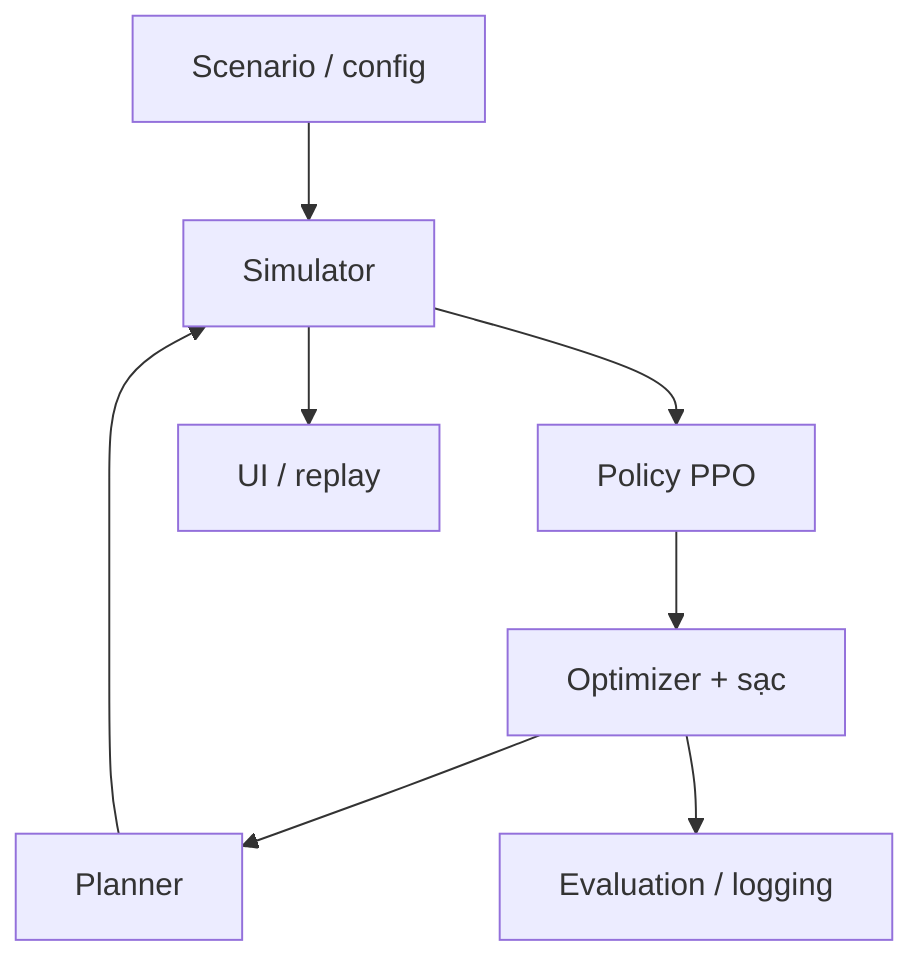
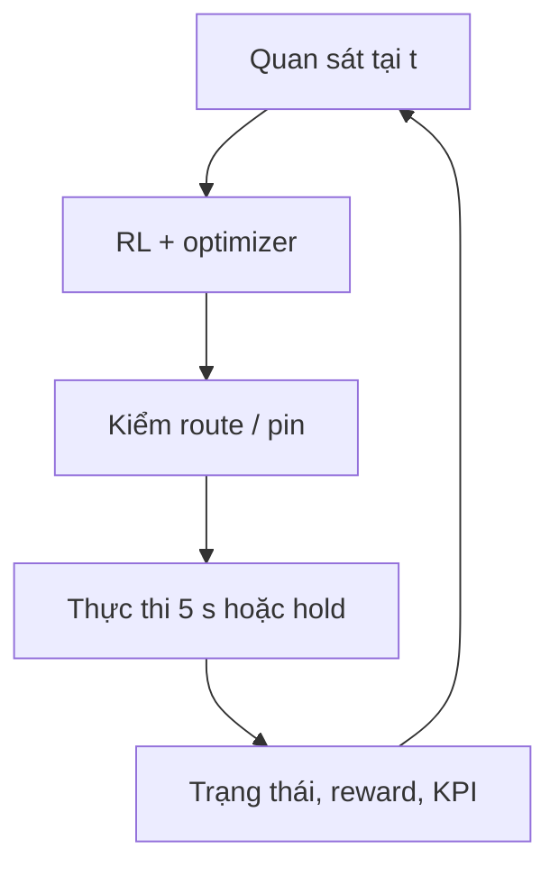

# Proposal - Điều phối giao việc và sạc cho đội robot kho không đồng nhất

> Bản nguồn chỉnh sửa được. PDF A4 gồm 20 trang; dấu ngắt trang dưới đây khớp bản dàn trang.

<!-- PAGE 1 -->
## 01 / TÓM TẮT ĐIỀU HÀNH - Điều phối giao việc và sạc cho đội robot kho không đồng nhất

**Joint Task and Charging Coordination for Heterogeneous Warehouse Robot Fleets using Reinforcement Learning and Optimization**

PROPOSAL FINAL PROJECT MÔN REINFORCEMENT LEARNING
Phiên bản 1.0 | 11/09/2026 | Người đề xuất: Nguyễn Xuân Trung và nhóm

| Quy mô | Thời gian / nhân lực | Môi trường |
| --- | --- | --- |
| 10-20 robot; 3 loại năng lực | 8 tuần; 4 sinh viên pre-junior | Mô phỏng 2D; laptop RTX 4050 6 GB, RAM ≥32 GB |

### Một người quản lý AI cho kho hàng

Mỗi robot giống một nhân viên vận chuyển có sức chở, tốc độ và năng lượng khác nhau. Sản phẩm dự kiến giúp người vận hành quyết định ai nhận việc, ai chờ hoặc chuyển khu vực, ai đi sạc và sạc tới đâu. RL học cách đổi ưu tiên theo tình hình; bộ tối ưu chọn phương án khả thi; bộ lập đường đi tổ chức di chuyển trong mô phỏng.

Khi đơn gấp tăng ở khu B, một robot khỏe gần đó còn ít pin và hành lang bị chặn, hệ thống phải xét robot đủ tải, đường vòng, pin sau nhiệm vụ và lịch cổng sạc. Robot phù hợp có thể nhận đơn; robot khác sạc một phần để quay lại phục vụ sớm. Đây là hành vi cần kiểm chứng, chưa phải kết quả đã đạt.

**Đầu ra cuối môn:** simulator, bộ điều phối RL + optimization, sạc nâng cao, dashboard, baseline, benchmark tái lập, checkpoint và báo cáo phân tích lỗi. Đề nghị duyệt phạm vi final project; chỉ xem xét pilot giới hạn sau khi có dữ liệu và bằng chứng đánh giá.

### Bản đồ đọc tài liệu

| Phần / trang | Phần / trang |
| --- | --- |
| 2. Bài toán & bối cảnh - 2 | 7. Trải nghiệm & demo - 12-13 |
| 3. Mục tiêu & tiềm năng - 3 | 8. Kiến trúc & tài nguyên - 14-15 |
| 4. Phạm vi & mô hình - 4-5 | 9. Đánh giá & bằng chứng - 16-17 |
| 5. Chức năng - 6-8; 6. RL & tối ưu - 9-11 | 10. Kế hoạch & pilot - 18-19; Nguồn - 20 |

<!-- PAGE 2 -->
## 02 / BÀI TOÁN VÀ BỐI CẢNH - Giá trị nằm ở quyết định vận hành

| Người dùng | Vấn đề cần xử lý / đầu ra cần xem |
| --- | --- |
| Người vận hành kho | Đơn gấp, robot dừng, đường chặn; cần bản đồ sống, cảnh báo và fallback. |
| Quản lý vận hành | Đơn trễ, robot dồn vùng hoặc cùng đi sạc; cần năng suất, tồn đơn và chờ sạc. |
| Đội tích hợp robot | Khác tải, pin, cổng sạc và API; cần hợp đồng trạng thái/lệnh, log và replay. |
| Tech lead | Cần biết RL có đóng góp không, giới hạn mô hình và chi phí tích hợp pilot. |

### Vì sao thử RL; khi nào chưa cần RL?

Giao robot gần nhất có thể tiết kiệm vài giây hiện tại nhưng để lại đội robot thiếu pin khi đơn tăng. Sạc đầy giúp làm lâu hơn nhưng chiếm cổng và giảm lực lượng sẵn sàng. RL có cơ hội học đánh đổi dài hạn từ lịch sử nhu cầu. Nếu đơn đều, ít tắc nghẽn và luật vận hành ổn định, heuristic hoặc tối ưu theo cửa sổ ngắn có thể đã đủ tốt; chi phí học chưa chắc đáng bỏ ra.

### Những hướng đã tồn tại

**Điều phối đội robot:** Amazon mô tả DeepFleet hỗ trợ phối hợp chuyển động trong mạng lưới fulfillment. Đây là thông tin do doanh nghiệp công bố; nguồn không xác nhận DeepFleet dùng RL. Không chuyển số liệu của Amazon thành mục tiêu hoặc thành tích của nhóm. [S1]

**Liên thông hệ thống:** Open-RMF hỗ trợ phối hợp fleet với hạ tầng như cửa, thang máy. Muốn tích hợp vẫn cần fleet adapter, bản đồ và API trạng thái/điều khiển của nhà cung cấp. Đây là hướng sau môn học, chưa nằm trong bản demo. [S2, S3]

**Học và tối ưu:** GRAND dùng RL định hướng phân bố robot, kết hợp tối ưu luồng và phân công, đánh giá bằng mô phỏng. Công trình này không giải bài toán sạc của đề tài. Nghiên cứu Persistent Robot Charging xét lịch sạc robot không đồng nhất, nhưng bối cảnh minh họa là UAV; sạc một phần online vẫn cần nhóm tự thiết kế và kiểm chứng. [S4, S5]

### Điểm cần kiểm chứng của nhóm

Giả thuyết: trong kho nhỏ có robot khác năng lực và sạc hữu hạn, ưu tiên học theo trạng thái giúp phối hợp giao việc và sạc tốt hơn trọng số cố định. Ghép RL với solver không tự tạo tính mới. Đóng góp kỳ vọng là thiết kế có thể tái lập và bằng chứng chỉ rõ điều kiện phương pháp có hoặc không có lợi.

Đề tài thuộc điều phối tác vụ, không học cầm nắm hay điều khiển động cơ. Xu hướng trên hỗ trợ tính phù hợp của bài toán, không dự báo chắc chắn thành công thương mại.

<!-- PAGE 3 -->
## 03 / MỤC TIÊU VÀ BA HƯỚNG TIỀM NĂNG - Ba hướng giá trị, ba loại bằng chứng

**Mục tiêu chính:** tăng nhiệm vụ hoàn thành mỗi giờ mô phỏng trong khi kiểm soát đơn trễ và tồn. **Mục tiêu phụ:** giảm chờ sạc, năng lượng mỗi nhiệm vụ và thời gian ra quyết định. Tải trọng, pin theo mô hình, cổng sạc và xung đột chuyển động là ràng buộc bắt buộc; deadline là mục tiêu mềm khi quá tải.

### Hướng 1 - Có cơ sở hướng tới 9+/10

| Giá trị / deliverable | Đánh giá / giới hạn |
| --- | --- |
| RL có đóng góp; solver có mô hình thật; simulator và demo đáng tin. Giao repo, checkpoint, ablation, log lỗi và báo cáo. | So sánh công bằng, nhiều seed, KPI cả đơn tồn; giải thích được quyết định từng module. Chưa có rubric trường; không bảo đảm điểm. |

**Thang tự kiểm tra nội bộ, tổng 100:** thiết kế RL 20; optimization + sạc 20; độ đúng simulator 20; thực nghiệm 25; demo và khả năng tái lập 10; hiểu bài và đóng góp nhóm 5. Nhắm ≥90/100 trên thang này là mục tiêu nội bộ, không quy đổi thành điểm môn học.

### Hướng 2 - Phát triển sau môn học

| Giá trị / deliverable | Đánh giá / giới hạn |
| --- | --- |
| Tái sử dụng engine, schema, replay và adapter. Bổ sung dữ liệu thật, hiệu chỉnh năng lượng/di chuyển, mở rộng bản đồ. | Đo sai số mô phỏng trên log giữ riêng; kiểm thử hợp đồng API. Chưa có ROS, robot thật hoặc khả năng mở rộng đã được đo. |

### Hướng 3 - Ứng dụng thực tế

| Giá trị / deliverable | Đánh giá / giới hạn |
| --- | --- |
| Ứng viên: kho fulfillment nhỏ hoặc đội tích hợp có 10-20 AMR và ùn tắc sạc. Giao hồ sơ benchmark, đề cương pilot và danh sách dữ liệu. | Đo năng suất, đơn trễ, thời gian can thiệp và chi phí tích hợp. Chưa xác nhận khách hàng, ROI, chứng nhận an toàn hay quyền điều khiển fleet. |

### Điều kiện chấp nhận nghiên cứu

Không cần RL thắng mọi kịch bản. Bản cuối phải hoạt động đủ phạm vi, minh bạch baseline và tìm được giới hạn. Nếu RL không hơn solver, nhóm trình bày kết quả âm cùng phân tích độ nhạy, độ trễ và chi phí học; không hạ chất lượng baseline để tạo chiến thắng.

<!-- PAGE 4 -->
## 04 / PHẠM VI VÀ MÔ HÌNH - Cấu hình tham chiếu có thể triển khai

| Mốc | Có trong phạm vi | Ngoài phạm vi mốc đó |
| --- | --- | --- |
| Bản đầu - tuần 2 | 5 robot để kiểm lỗi; baseline, pin, cổng sạc, tốc độ headless. | Chưa coi là bản cuối; chưa yêu cầu policy tốt. |
| Bản cuối - hết tuần 6 | 10/15/20 robot; giao việc + sạc nâng cao; đường đi; UI; benchmark. | Không camera, 3D, ROS, multi-agent RL hay robot thật. |
| Sau môn học | Dữ liệu vận hành, hiệu chỉnh, adapter và shadow mode. | Không mặc định tích hợp hoặc thương mại hóa thành công. |

### Kho giả định

Bản đồ A là lưới 40 × 30 ô, mỗi ô 1 m. Bốn vùng công việc; 12 điểm lấy, 4 điểm trả; 6 vùng đỗ ngoài luồng chính. Kệ là ô cấm. Hành lang hẹp dùng quyền đi một chiều tại một thời điểm, có điểm tránh ở hai đầu. Bản đồ B giữ riêng để đánh giá tổng quát hóa, thay vị trí kệ, điểm giao và trạm sạc.

Hai trạm ở hai phía kho, mỗi trạm 2 cổng và 4 ô chờ riêng. Mỗi cổng cấp cố định 600 W, hiệu suất nạp giả định 90%. Trạm A nhận robot loại nhẹ/trung; trạm B nhận cả 3 loại. Chia công suất động giữa nhiều cổng là **phần bổ sung sau môn**, không thuộc sạc nâng cao bắt buộc.

| Loại robot | Tốc độ / tải tối đa | Pin / tiêu thụ di chuyển |
| --- | --- | --- |
| Nhẹ (L) | 2,0 m/s / 20 kg | 180 Wh / 0,035 Wh/m |
| Trung (M) | 1,0 m/s / 50 kg | 300 Wh / 0,055 Wh/m |
| Nặng (H) | 0,75 m/s / 100 kg | 450 Wh / 0,085 Wh/m |

Tỷ lệ L/M/H tham chiếu là 40/40/20%: 4/4/2, 6/6/3 hoặc 8/8/4. Pin ban đầu 25-90%, cùng seed giữa các phương pháp. Các giá trị này là giả định mô phỏng, không phải thông số AMR thương mại.

### Nhiệm vụ và nhu cầu

Mỗi nhiệm vụ gồm ID, điểm lấy/trả, khối lượng 5/15/40/80 kg, thời điểm xuất hiện, ưu tiên 1 hoặc 3, và deadline. Lấy/trả mỗi lần 10 s. Sinh đơn Poisson theo vùng với cường độ thay đổi từng đoạn; khởi đầu thử 60/90/120 đơn mỗi giờ cho 10/15/20 robot, sau đó hiệu chỉnh trên train để có tải vừa và quá tải. Deadline = thời điểm tạo + 1,5-3 lần thời gian phục vụ danh định; hệ số thấp dành cho đơn gấp.

<!-- PAGE 5 -->
## 04 / PHẠM VI VÀ MÔ HÌNH - Thời gian, năng lượng và sự cố

Simulator tiến mỗi 0,5 s; điều phối định kỳ mỗi 5 s. Thời gian đi cạnh dài d: **t = ceil((d/v)/0,5) × 0,5 s**. Chờ xung đột, lấy/trả và sạc cũng dùng giây mô phỏng. UI chỉ điều chỉnh tốc độ phát, không điều chỉnh đồng hồ dùng để tính KPI.

### Mô hình năng lượng nhất quán

Với tải m, tải tối đa Q, quãng đường d và tổng thời gian Δt: **E tiêu thụ = a × (1 + 0,5m/Q) × d + 12 × Δt/3600 Wh**. Thành phần 12 W là phụ tải nền khi đi/chờ/lấy/trả; không cộng lại lần hai. Dự phòng bắt buộc R = 10% dung lượng pin B.

Khi sạc: tốc độ nạp r = (0,9 × 600 - 12)/3600 Wh/s tới 80% pin; trên 80%, r = (0,9 × 300 - 12)/3600 Wh/s. Thời gian tới mục tiêu bằng tổng ΔE/r theo từng đoạn, làm tròn lên tick. SoC (state of charge) = E/B. Đây là mô hình tuyến tính từng đoạn có thể hiệu chỉnh, chưa mô hình hóa nhiệt hoặc lão hóa pin.

Robot chỉ nhận việc nếu đủ năng lượng đi lấy, mang hàng, xử lý, đi tới trạm tương thích, chờ trên đường tối đa 300 s, chờ sạc tối đa 300 s và còn R. Giới hạn chờ này là giả định vận hành cần kiểm tra, không phải bảo đảm một cổng sẽ trống. Nếu lịch trạm không cho thấy khả năng phục vụ trong giới hạn thì loại ứng viên và cân nhắc sạc trước. Kiểm tra lại khi thực thi và khi có sự cố; vượt giả định phải ghi energy_emergency, thử phục hồi rồi dừng ở điểm an toàn nếu còn tới được. Đây là vi phạm giả định, không tính là kế hoạch thành công.

| Sự kiện | Quy tắc chốt |
| --- | --- |
| Lối đi bị chặn | Không cho vào cạnh mới; giữ chiếm chỗ hiện tại, tính đường vòng. Chỉ chặn đoạn trống khi demo, không đặt vật cản xuyên robot. |
| Robot tạm ngừng | Giữ vị trí như chướng ngại; hủy lệnh chưa lấy hàng. Hàng đang mang chờ robot phục hồi, chưa hỗ trợ bàn giao giữa robot. |
| Đơn mới / không khả thi | Đơn mới vào backlog ở tick tiếp; đơn quá tải hoặc mất kết nối giữ trạng thái blocked với lý do, vẫn tính vào tồn. |
| Trạng thái đến trễ | Snapshot có timestamp. Tuổi dữ liệu >10 s: ngừng giao việc mới cho robot đó, giữ đặt chỗ; mô phỏng trễ 0/5/15 s. |
| Không đủ pin / hết chỗ chờ | Không ép nhận việc. Dừng ở ô đỗ hợp lệ nếu còn tới được; gắn cờ cần can thiệp, không xóa robot/đơn khỏi KPI. |

Bộ não chỉ thấy đơn đã xuất hiện, trạng thái nhận được và thống kê quá khứ; lịch sự kiện tương lai nằm riêng trong simulator, không vào observation.

<!-- PAGE 6 -->
## 05 / CHỨC NĂNG VÀ NGHIỆM THU - Danh mục chức năng 1/3

P0: bắt buộc cuối môn. P1: hoàn thiện hỗ trợ. T2/T4/T6: hoàn thành ở tuần tương ứng. Mọi tiêu chí trong ba bảng là mục tiêu nghiệm thu đề xuất, chưa được kiểm thử.

| ID | Chức năng | Mô tả | Vào → ra | Ưu tiên | Mốc | Tiêu chí nghiệm thu đề xuất |
| --- | --- | --- | --- | --- | --- | --- |
| F01 | Cấu hình kho | Lưu/tải bản đồ, đội và trạm. | JSON → cấu hình hợp lệ | P0 | T2 | Tải lại giữ nguyên hash; từ chối tọa độ/cổng không hợp lệ. |
| F02 | Sinh kịch bản | Đơn theo vùng, tải và cao điểm. | Seed → event tape | P0 | T2 | Cùng seed và cấu hình tạo cùng đơn, thời điểm, sự cố. |
| F03 | Theo dõi robot | Trạng thái, tải, pin, tác vụ. | Tick → trạng thái, log | P0 | T2 | Mỗi robot có ID duy nhất; lịch sử khớp các lần chuyển trạng thái. |
| F04 | Giao việc | Chọn robot đủ tải và pin. | Đơn tồn → giao việc | P0 | T2 | Không giao trùng; không quá tải; đơn bị loại có reason code. |
| F05 | Đổi vùng chờ | Điều chuyển robot rảnh. | Nhu cầu → điểm đỗ | P0 | T4 | Đỗ ngoài luồng; không tranh một ô; ghi chi phí đi rỗng. |
| F06 | Ưu tiên động | Xét đơn gấp và tuổi đơn. | Đơn mới → cập nhật chi phí | P0 | T4 | Phản ánh đơn mới ở quyết định kế; không hủy việc đang mang hàng. |
| F07 | Đường đi | Đặt chỗ ô/cạnh theo thời gian. | Đích → route có lịch | P0 | T2 | Không chung ô hoặc đổi chỗ đối đầu trong bộ kịch bản kiểm thử. |
| F08 | Phục hồi sự cố | Đường chặn, dừng và deadlock. | Sự kiện → đổi đường / chờ | P0 | T4 | Thử đường vòng/điểm tránh có log; nếu không được, dừng có báo lỗi. |

### Nguyên tắc nghiệm thu

Kiểm cả trường hợp thành công và không có phương án. Một lệnh bị giữ lại kèm lý do hợp lệ có thể là hành vi đúng; làm mất đơn, giả hoàn thành hoặc cho robot đi xuyên nhau là lỗi. Danh sách này là hợp đồng giao việc của nhóm, không phải mô tả sản phẩm đã tồn tại.

<!-- PAGE 7 -->
## 05 / CHỨC NĂNG VÀ NGHIỆM THU - Danh mục chức năng 2/3 - Sạc nâng cao

Các chức năng F09-F13 cùng giải bài toán giao việc và sạc; không triển khai như một bộ demo sạc tách rời.

| ID | Chức năng | Mô tả | Vào → ra | Ưu tiên | Mốc | Tiêu chí nghiệm thu đề xuất |
| --- | --- | --- | --- | --- | --- | --- |
| F09 | Sạc chủ động | Xét việc, pin, nhu cầu và thời gian rảnh. | Trạng thái → sạc / làm | P0 | T4 | Cùng SoC nhưng nhu cầu khác có thể cho quyết định khác; lưu điều kiện lựa chọn. |
| F10 | Đặt lịch cổng | Xét đường tới, tương thích và hàng đợi. | Ứng viên → cổng, lịch | P0 | T4 | Mỗi cổng chỉ phục vụ một robot; robot đến trễ phải cập nhật đặt chỗ. |
| F11 | Sạc một phần | Chọn đích 60/80/95% pin. | SoC → đích/thời lượng | P0 | T4 | Tới đích thì nhả cổng; sai số ≤1 tick nạp; không mặc định sạc đầy. |
| F12 | Phối hợp sạc/việc | Phạt thiếu robot sẵn sàng phục vụ. | Các lựa chọn → kế hoạch chung | P0 | T4 | Đo số robot sẵn sàng, thiếu hụt theo vùng và đơn đang chờ. |
| F13 | Kiểm tra năng lượng | Tính đường làm việc và về sạc có dự phòng. | Wh cần/có → nhận/chờ | P0 | T2 | Không nhận ứng viên thiếu pin theo mô hình; hết phương án có cờ can thiệp. |
| F14 | Huấn luyện RL | Curriculum và log thành phần reward. | Config/seed → policy | P0 | T4 | Đủ vòng rollout/update; không NaN; lưu đường học và ngân sách. |
| F15 | Quản lý policy | Lưu/tải và chọn checkpoint. | Policy ID → suy luận | P0 | T4 | Tải lại trên cùng máy tái hiện action xác định của snapshot mẫu. |
| F16 | Điều khiển mô phỏng | Start/pause/reset; đổi tốc độ. | UI → điều khiển phiên | P0 | T4 | Pause không tăng giờ mô phỏng; đổi tốc độ không đổi event tape/KPI. |

**Chia công suất giữa các cổng:** không thuộc P0/P1 của bản cuối. Công suất mỗi cổng là cố định; kịch bản giảm công suất dùng để đánh giá. Không gọi việc thay công suất cấu hình là đã tối ưu phân bổ điện giữa cổng.

<!-- PAGE 8 -->
## 05 / CHỨC NĂNG VÀ NGHIỆM THU - Danh mục chức năng 3/3 - Bằng chứng và vận hành

| ID | Chức năng | Mô tả | Vào → ra | Ưu tiên | Mốc | Tiêu chí nghiệm thu đề xuất |
| --- | --- | --- | --- | --- | --- | --- |
| F17 | Dashboard 2D | Bản đồ, robot, pin, đơn, sạc, KPI. | Trạng thái → màn hình | P0 | T4 | Chọn robot xem được tải/pin/tác vụ và lịch gần nhất. |
| F18 | Tạo sự cố demo | Tăng đơn, chặn đường, dừng robot. | Thao tác → sự kiện có giờ | P0 | T4 | Mỗi sự kiện lưu vào tape để chạy lại cho cả baseline. |
| F19 | Log quyết định | Hiện action, chi phí và ràng buộc. | Decision → bảng lý do | P0 | T6 | Ghi policy/profile, solver status, timeout, reason code; không bịa giải thích nhân quả RL. |
| F20 | Đo hiệu năng | Chạy các phương pháp cùng kịch bản. | Manifest → CSV/biểu đồ | P0 | T6 | Đủ seed; cùng đơn đầu vào; đơn chưa xong hiện trong kết quả. |
| F21 | Replay phiên | Phát snapshot và sự kiện đã lưu. | Run ID → phát lại | P0 | T6 | Hiện nhãn REPLAY; đối chiếu KPI/log gốc; không giả suy luận trực tiếp. |
| F22 | Fallback | Xử lý lỗi policy/solver/state. | Lỗi → kế hoạch bảo thủ | P0 | T4 | Tiêm NaN/timeout/snapshot cũ không crash; giữ ràng buộc và có log. |
| F23 | Xuất gói bằng chứng | Gom config, hash, phiên bản, báo cáo. | Run IDs → hồ sơ đánh giá | P1 | T6 | Một manifest truy được commit, seed, policy, số liệu và video/replay. |

### Ba bài kiểm tra tích hợp bắt buộc

**Giao việc - sạc:** ít nhất một robot không đủ pin làm đơn dài, một trạm bận; hệ thống chọn phương án có lịch và ghi rõ việc bị hoãn. **Chuyển động:** hai robot đối đầu trong hành lang hẹp phải chờ/nhường, không đi xuyên nhau. **Khả năng phục hồi:** policy lỗi giữa phiên thì chuyển fallback, tiếp tục ghi toàn bộ KPI.

T2 dùng bộ test nhỏ có đáp án tính tay; T4 chạy tích hợp 10 robot; T6 nghiệm thu đủ 10/15/20 robot. Các dòng chưa đạt phải để trạng thái chưa đạt trong báo cáo, kể cả khi dashboard chạy được.

<!-- PAGE 9 -->
## 06 / RL VÀ OPTIMIZATION - RL học cách ưu tiên, không điều khiển từng robot

Chọn **PPO tập trung** (Proximal Policy Optimization): một policy nhìn đội robot và chọn một trong sáu bộ trọng số cho solver. Đây là học chính sách điều phối cấp cao; robot không có agent học riêng. PPO hỗ trợ action rời rạc và observation có cấu trúc; bản MLP có thể chạy CPU. [S6]

| Thành phần | Thiết kế chốt |
| --- | --- |
| Episode / bước | Một ca 3.600 s, 720 quyết định cách nhau 5 s; simulator 0,5 s/tick. Nhiệm vụ dài tiếp tục qua nhiều quyết định; không gộp bước theo thời lượng action. |
| Observation | 20 hàng robot × 14 đặc trưng; 40 task × 10; 4 cổng × 6; thống kê 4 vùng và 4 cửa sổ quá khứ. Padding + mask; robot theo ID, task theo deadline/tuổi. |
| Thông tin chi tiết | Vị trí, loại, tải, SoC, trạng thái, thời gian còn lại, tuổi snapshot; task lấy/trả, cân nặng, ưu tiên, slack; trạm bận/chờ; tắc nghẽn và tốc độ đơn 60 s qua. |
| Quá 40 task | Danh sách ưu tiên gồm đơn gấp và đơn già nhất; lưu thống kê phần còn lại. Toàn bộ backlog vẫn vào reward/KPI; không xóa đơn ngoài observation. |
| Action | Discrete(6): cân bằng, ưu tiên trễ, tích pin, giữ lực lượng, giảm đi rỗng, giảm lệch vùng. Bảng hệ số cụ thể ở trang 10. |
| Mạng / học | Flatten vector + mask, actor/critic MLP 2 × 128; PPO clip 0,2; learning rate 3e-4; gamma 0,995; GAE 0,95; rollout 1.024/env; batch 256. |

### Reward và chống chọn việc dễ

Đặt C là số đơn hoàn thành trong bước; Q là backlog trung bình theo thời gian; L là số đơn quá deadline chưa xong có trọng số ưu tiên; e là Wh tiêu thụ. **r = C - 0,2(Q/40) - 0,4(L/40) - 0,02(e/10) - 10V**. V đếm sự kiện vi phạm pin/xung đột mới; ràng buộc vẫn do tầng thực thi kiểm tra, không chỉ dựa vào phạt.

Kết ca trừ thêm **U/40 + D/600**, với U là tất cả đơn còn tồn và D là tổng giây trễ tích lũy của mọi đơn. Không có action từ chối/xóa đơn. Phạt backlog theo toàn ca, phạt đơn trễ theo ưu tiên; báo cáo kết quả theo nhóm tải và ưu tiên để phát hiện bỏ đói đơn khó. Các hệ số là khởi điểm, chỉ chỉnh trên validation.

Ca hữu hạn là kết thúc bài toán: đưa thời gian còn lại vào observation, kết ca terminated=True; dừng kỹ thuật ngoài ca là truncation. Đây là mô hình quan sát một phần do chỉ biết lịch sử nhu cầu; MLP không được giả định biết tương lai. [S7]

<!-- PAGE 10 -->
## 06 / RL VÀ OPTIMIZATION - Solver chọn giao việc và lịch sạc chung

Chọn OR-Tools CP-SAT: mỗi robot rảnh chọn đúng một thao tác kế tiếp; robot đã nhận lệnh, kể cả đang đi lấy hàng/đi sạc, giữ cam kết tới khi hoàn tất hoặc có sự cố hợp lệ. Đây là tối ưu phân công và lịch cổng sạc với thời điểm bắt đầu được xét trong 900 s tới, không phải tối ưu toàn bộ ca hay mọi đường đi. CP-SAT dùng biến nguyên; lịch dùng tick 0,5 s và chi phí nhân 1.000 rồi làm tròn. [S8]

**Biến:** xᵢⱼ giao task j cho robot i; yᵢcq chọn cổng c và đích sạc q; zᵢv chọn vùng đỗ v; wᵢ chờ. Có thời điểm bắt đầu sᵢcq và khoảng sạc tùy chọn. Ứng viên sạc có đích lớn hơn SoC lúc đến; lịch chiếm cổng tính cả 5 s vào/ra mỗi đầu. Start là biến nguyên trên lưới 5 s; không liệt kê mọi slot. Thời lượng đặt chỗ tính bảo thủ từ pin khi đến trừ phụ tải cho 300 s chờ và 5 s vào cổng; start không quá ETA + 300 s. Toàn bộ đuôi lịch sạc được giữ dù vượt cửa sổ 900 s; đến đích sớm thì nhả phần dư.

**Ràng buộc:** Σⱼxᵢⱼ + Σcqyᵢcq + Σvzᵢv + wᵢ = 1; Σᵢxᵢⱼ ≤ 1. Loại cặp sai tải/khả dụng/tương thích/pin. Các khoảng tùy chọn và đặt chỗ đang giữ không được chồng trên một cổng; khoảng chờ [ETA,start) dùng Cumulative ≤4 mỗi trạm; planner chọn ô chờ vật lý. Deadline và số robot sẵn sàng tối thiểu là chi phí mềm, để ca quá tải vẫn có phương án. Mô hình lịch dùng interval/NoOverlap. [S9]

### Hàm mục tiêu và sáu lựa chọn của RL

Tối thiểu **-4Ĉ + wT·T̂ + 0,2Ê + 0,3B̂ - wG·Ĝ + wA·Â + wZ·Ẑ**. Ĉ: việc được nhận; T̂: trễ dự kiến và hoãn đơn có tuổi; Ê: năng lượng; B̂: thời gian đi/chờ/sạc chiếm robot; Ĝ: năng lượng tăng tới 80% tính đủ, phần 80-95% tính 0,3 lần; Â: thiếu robot có thể nhận việc; Ẑ: lệch lực lượng so với nhu cầu vùng. Chuẩn hóa: Ĉ chia số robot Nᵣ; T̂/600 s; Ê và Ĝ/100 Wh; B̂/900 s; Â và Ẑ/Nᵣ. Â là thiếu robot không sạc/có thể nhận việc so với ceil(λ̂ × τ̂), chặn trong [0,Nᵣ]; λ̂ và τ̂ lấy từ 60 s quá khứ. Ẑ là tổng sai lệch lực lượng theo tỷ lệ đơn các vùng; cả hai dùng biến slack không âm.

| Profile | wT | wG | wA | wZ |
| --- | --- | --- | --- | --- |
| Cân bằng | 1 | 1 | 1 | 1 |
| Ưu tiên trễ | 3 | 0,5 | 1 | 1 |
| Tích pin | 1 | 3 | 0,5 | 1 |
| Giữ lực lượng | 1 | 0,5 | 3 | 1 |
| Giảm đi rỗng* | 1 | 1 | 1 | 1 |
| Cân vùng | 1 | 1 | 1 | 3 |

*Profile giảm đi rỗng tăng hệ số Ê từ 0,2 lên 1. Solver quyết định robot/task/cổng/đích/start; RL chỉ chọn profile, không thay ràng buộc. Mọi profile hợp lệ; ứng viên vật lý không hợp lệ bị loại ở solver. NaN hoặc action ngoài miền dùng profile cân bằng và ghi fallback.

Ĝ giúp sạc chủ động có giá trị trong bài toán một bước; thời gian vắng mặt và thiếu lực lượng ngăn sạc vô ích. Đây là giả thuyết surrogate cần ablation, chưa phải giá trị tương lai chính xác.

<!-- PAGE 11 -->
## 06 / RL VÀ OPTIMIZATION - Đường đi, sạc và một ví dụ xuyên suốt

| Module | Quyền quyết định / dữ liệu trả về |
| --- | --- |
| RL | Chọn profile chi phí; trả profile ID và xác suất action. |
| Optimizer | Chọn việc/đỗ/sạc, cổng, đích pin, thời điểm sạc; trả kế hoạch và solver status. |
| Path planner | A* có trục thời gian; đặt chỗ ô/cạnh và hành lang hẹp; trả route, ETA, thời gian chờ hoặc không có route. |
| Simulator | Thực thi tick, pin, tải, sự kiện; kiểm xung đột độc lập; trả snapshot/reward/log. |

Lập đường theo thứ tự ưu tiên: robot đang mang hàng, pin khẩn, tuổi chờ, rồi ID. Đặt chỗ cả đỉnh và cạnh để ngăn chung ô và đổi chỗ đối đầu; hành lang một làn giữ quyền đi theo chiều cho tới khi ra hết. Lập lịch 60 s phía trước, chỉ thực thi đoạn 5 s đã đặt chỗ. ETA và chờ cập nhật chi phí lần giải tiếp; solver chỉ cam kết sau khi route và pin được kiểm lại.

Không tiến triển 30 s khi đang cần di chuyển là dấu hiệu deadlock; loại thời gian lấy/trả, sạc và chờ có lịch hợp lệ. Thử đổi thứ tự và đưa robot chưa mang hàng về ô tránh tối đa hai lần; nếu vẫn bế tắc thì giữ vị trí, ghi unresolved và yêu cầu can thiệp. A* ưu tiên không bảo đảm tìm được mọi lời giải tồn tại; bộ test phải đo giới hạn này.

### Ví dụ minh họa, không phải kết quả chạy

Đơn J cần chở 40 kg, deadline còn 150 s. R1 loại L gần nhất nhưng chỉ chở 20 kg; R2 loại M có 90 Wh; R3 loại H có 67,5 Wh. Trạm A còn bận 120 s, B có cổng trống. Một hành lang vừa bị chặn.

Planner tính đường vòng của R2: đi rỗng 20 m, chở 50 m, về trạm 30 m; tổng đi 100 s và xử lý 20 s. Theo mô hình trang 5, năng lượng là 6,6 + 0,4 = 7 Wh; cộng 2 Wh cho chờ đường và chờ sạc (mỗi loại 300 s), cộng dự phòng 30 Wh, cần 39 Wh. R2 đủ pin, R1 sai tải; R3 chỉ nhận nếu kiểm riêng đủ cả đường, lịch và dự phòng 45 Wh.

Giả sử RL chọn ưu tiên trễ, solver có thể giao J cho R2, đặt R3 tới B sạc 60% và giữ robot khác phục vụ. Planner phải xác nhận ETA hoàn thành J và đường tới B; simulator cập nhật pin từng tick. Log chỉ nói profile, chi phí và ràng buộc quan sát được, không nói “RL hiểu rằng…” nếu chưa có phân tích hỗ trợ.

Commit nguyên tử task/route/cổng theo snapshot ID. Nếu planner không xác nhận ETA và pin, hủy đề xuất, giữ phần cam kết còn hợp lệ và cập nhật chi phí. ETA đổi phải sửa/hủy lịch tương lai, kiểm lại pin và chồng lịch trước khi commit. Policy lỗi dùng profile cố định; solver không có nghiệm dùng EDF + robot gần nhất đủ điều kiện, ưu tiên sạc khẩn ở cổng khả thi. Tất cả dùng ngân sách 250 ms còn lại; không đủ thì HOLD và log, không thực thi lệnh chưa kiểm.

Nếu nhu cầu đều và lịch sạc ít tranh chấp, trọng số cố định có thể tương đương hoặc tốt hơn. So sánh full với optimizer giữ nguyên ứng viên/ràng buộc, cùng test tape, sẽ kiểm chứng giả thuyết đó.

<!-- PAGE 12 -->
## 07 / TRẢI NGHIỆM VÀ DEMO - Kiến trúc module và giao diện demo

**Bản đồ ở trái:** màu vùng, kệ, đường chặn, robot có ID và thanh pin; bật/tắt route đặt chỗ. **Bảng phải:** task được chọn, robot/tải/SoC, cổng sạc với thời gian bắt đầu/kết thúc và hàng đợi. **Thanh trên:** giờ mô phỏng, throughput, tồn, trễ, chờ sạc. **Thanh dưới:** điều khiển và decision log.

Bốn nút kịch bản: tăng đơn khu B, giảm pin ban đầu qua reset, chặn lối đi và tạm dừng robot. Không đổi pin đột ngột giữa ca bình thường; nếu cố ý tiêm lỗi pin phải gắn nhãn fault injection và lưu tape. Màu không là tín hiệu duy nhất: kèm chữ IDLE/WORK/CHARGE/HOLD và lý do.

| Luồng người dùng | Đầu ra quan sát |
| --- | --- |
| Chọn cấu hình và policy | Hiện map/seed/hash/policy ID; kiểm dữ liệu trước start. |
| Chạy hoặc pause, chọn robot | Vị trí, tải, pin, nhiệm vụ và phần lịch đã cam kết. |
| So sánh hai phương pháp | Hai phiên độc lập cùng tape và trạng thái đầu; cùng mốc giờ mô phỏng. |
| Xem lỗi hoặc replay | Nhãn LIVE/REPLAY rõ; log và cờ fallback không bị ẩn. |

UI Pygame phục vụ demo cục bộ. Không xây đăng nhập, quản trị kho hoặc CRUD đơn hàng. Engine vẫn chạy và xuất KPI khi không mở cửa sổ.

<!-- PAGE 13 -->
## 07 / TRẢI NGHIỆM VÀ DEMO - Vòng phản hồi và kịch bản bảo vệ 6 phút

| Thời điểm / thao tác | Hành vi kỳ vọng / số liệu | Demo thất bại nếu |
| --- | --- | --- |
| 0:00-1:00: chạy 15 robot, tải thường | Có giao việc, pin thay đổi; hiện nhiệm vụ/h và tồn. | Không chạy được policy đã lưu hoặc đồng hồ/KPI lệch. |
| 1:00-2:00: phát đợt đơn khu B | Đổi ưu tiên hoặc điều vùng; quan sát tuổi đơn và robot rảnh. | Đơn biến mất hoặc robot nhận tải vượt năng lực. |
| 2:00-3:15: xem pin thấp và trạm bận trong tape | Có đặt cổng và sạc một phần; hiện đích pin, queue và readiness. | Trùng cổng, thiếu pin bị giấu, luôn sạc đầy ngoài cấu hình. |
| 3:15-4:15: phát sự kiện chặn đường | Chờ/đi vòng/hold có lý do; xem ETA và số lần replan. | Đi xuyên vật cản hoặc bế tắc không có cảnh báo. |
| 4:15-6:00: đối chiếu baseline | Cùng giờ mô phỏng, bảng cả đơn tồn; giải thích trade-off. | So khác tape hoặc tuyên bố thắng từ một lượt demo. |

Hai phương pháp dùng cùng event tape ngoại sinh và trạng thái ban đầu, kể cả sự cố. Sự kiện gắn với giờ mô phỏng, không gắn thời gian bấm chuột. Buổi bảo vệ dùng checkpoint đóng băng; không huấn luyện tại chỗ. Chuẩn bị replay cùng phiên và video dự phòng; khi chuyển sang replay phải nói rõ đây là bản ghi.

Demo chứng minh luồng hoạt động. Kết luận về hiệu quả lấy từ benchmark nhiều seed ở phần 9, không từ hiệu ứng trực quan hoặc tốc độ phát.

<!-- PAGE 14 -->
## 08 / KIẾN TRÚC, CÔNG NGHỆ VÀ TÀI NGUYÊN - Stack tối thiểu và hợp đồng dữ liệu

| Thành phần | Lựa chọn chính / lý do |
| --- | --- |
| Runtime / simulator | Python 3.11; NumPy; engine tick riêng bọc Gymnasium Env. Trạng thái có cấu trúc, dễ test và tắt render. [S7] |
| RL | PyTorch + Stable-Baselines3 PPO MlpPolicy. Chọn CPU trước cho MLP nhỏ; GPU chỉ khi phép đo cho thấy lợi. [S6] |
| Optimization / planner | OR-Tools CP-SAT; A* theo thời gian tự viết và reservation table. Một solver cho giao việc + lịch sạc. [S8, S9] |
| UI / kết quả | Pygame 2D; Matplotlib xuất biểu đồ. Clock của Pygame chỉ giới hạn khung hình, không làm đồng hồ simulator. [S10] |
| Dữ liệu / chất lượng | JSON cấu hình; JSONL quyết định/sự kiện; CSV KPI; SQLite chỉ mục run; pytest; Git. Không cần server DB. |
| Adapter | Python Protocol: get_snapshot(), submit_plan(), poll_events(). Đổi nguồn trạng thái sau này; chưa cần REST server. |

### Hợp đồng giữa module

**StateSnapshot v1:** run_id, sim_time_s, observed_at_s, map_version, robot/task/charger states, blocked_edges và state_hash. Bản sao bất biến; dữ liệu trễ mang timestamp, không âm thầm dùng trạng thái thật mới hơn trong observation.

**DecisionPlan v1:** decision_id, based_on_state_hash, profile_id, assignments, target_SoC, charger intervals, routes, valid_until, solver_status và fallback_reason. submit_plan kiểm phiên bản, pin và đặt chỗ trước khi commit; ACK/REJECT cùng reason code; không thực thi lệnh cũ hai lần.

**RunManifest v1:** git_commit, package lock, config_hash, map_hash, event_tape_hash, train/test seeds, policy_hash, normalization_stats, CPU/GPU info, thời gian offline và budget online. Log tách proposed/accepted/executed để replay không đánh đồng ý định với kết quả.

### Tình trạng kiểm tra tương thích tại 11/09/2026

Đã kiểm tài liệu chính thức: Gymnasium có reset/step với terminated/truncated; SB3 PPO có action rời rạc; CP-SAT có trạng thái nghiệm và lịch không chồng; Pygame có cơ chế giới hạn FPS. Nhánh tài liệu SB3 master đang nêu Python ≥3.10, PyTorch ≥2.8. [S6-S10]

Chưa cài và kiểm tích hợp stack của project trong nhiệm vụ viết proposal. Tuần 1 phải chọn release ổn định, khóa toàn bộ phiên bản đã chạy import/check_env/save-load, không dùng tên nhánh master như một phiên bản tái lập.

<!-- PAGE 15 -->
## 08 / KIẾN TRÚC, CÔNG NGHỆ VÀ TÀI NGUYÊN - Ngân sách tính toán và đường dự phòng

Máy tham chiếu có RTX 4050 6 GB, RAM ≥32 GB; chưa biết CPU cụ thể. Simulator, solver và planner chủ yếu chạy CPU. PPO MLP thử CPU trước; tài liệu SB3 cũng lưu ý cấu hình không CNN thường phù hợp CPU. [S6] Không cần cloud ở phương án chính; chi phí dịch vụ dự kiến 0 USD, chưa tính điện và công lao động.

| Hạng mục | Mục tiêu nghiệm thu / ước lượng chưa đo |
| --- | --- |
| Một lần điều phối | Tổng ≤250 ms: snapshot + policy 20; dựng mô hình 30; CP-SAT 100; planner/kiểm pin 80; log/dự phòng 20 ms. Đo p50/p95/max. |
| Kích thước bài toán | ≤40 task được xem; ≤6 ứng viên/robot có đơn già/gấp; 2 trạm × 2 cổng × 3 đích. Chặn tổng lựa chọn rời rạc khoảng 500, không mở lịch đa nhiệm vụ. |
| Khi solver chậm | Một worker CP-SAT/env; 100 ms giới hạn. Có FEASIBLE thì kiểm lại; UNKNOWN/INVALID/INFEASIBLE dùng kế hoạch bảo thủ, không đọc nghiệm giả. |
| Đo sớm tuần 1-2 | 10.000 quyết định headless ở 5/10/20 robot; đo bước/s, CPU/RAM, tỷ trọng solver/planner. Quét 20/100 ms và 20/40 task trên train. |
| Tài nguyên dự trù | 2-4 env; RAM 4-12 GB; log/ảnh/checkpoint 5-15 GB. GPU tùy chọn <4 GB. Đây là dự trù, phải thay bằng phép đo thực tế. |

### Huấn luyện vừa sức

Curriculum: 5 robot/ít đơn để kiểm reward; 10 robot có sạc/biến động; cuối cùng trộn 10/15/20 robot, SoC và nhu cầu. Mỗi seed dự kiến 300.000 quyết định, có thể mở tới 600.000 khi budget cho phép. Ba seed full và ba seed ablation sạc theo ngưỡng; không cần huấn luyện lại ablation bỏ RL vì dùng solver cố định.

Nếu toàn bộ worker đạt 25-100 quyết định/s thì 6 × 300.000 bước cần khoảng 5-20 giờ thu thập; dự trù tổng 10-40 giờ gồm PPO/validation/ghi log. Benchmark 360 ca × 720 bước = 259.200 quyết định, khoảng 0,7-2,9 giờ ở tốc độ trên, dự trù 2-8 giờ. Các con số dựa trên tốc độ gộp worker, chưa đo. Nếu chạy tuần tự với mean 50/200 ms thì riêng benchmark mất 3,6/14,4 giờ; phải dự toán từ mean end-to-end đã đo, không từ p95.

**Dự phòng gọn:** giữ PPO nhưng giảm còn 3 profile cân bằng/ưu tiên trễ/tích pin, 20 task quan sát và 4 ứng viên/robot; một bản đồ train, UI tối giản. Giữ 10-20 robot, ba mức sạc, lịch cổng và đánh giá đóng góp RL. Nếu budget thiếu, giảm test từ 5 còn 3 tape/ca (216 ca), giữ ba seed học và ca 1 giờ. Nếu policy vẫn lỗi hoặc không có lợi, chế độ vận hành dùng optimizer đã tune; kết quả RL vẫn phải báo cáo.

<!-- PAGE 16 -->
## 09 / ĐÁNH GIÁ VÀ BẰNG CHỨNG - So sánh công bằng và ma trận thử nghiệm

| Phương pháp | Cấu hình so sánh |
| --- | --- |
| B0 - heuristic | Đơn theo ưu tiên/tuổi; robot phù hợp gần nhất. Sạc khi SoC <30% hoặc không đủ pin nhận việc, đích 95%; cùng lịch cổng và kiểm an toàn. |
| B1 - optimization | Cùng optimizer, ứng viên, sạc nâng cao và planner như full; profile cố định tốt nhất trên validation. Đây cũng là ablation bỏ RL. |
| H - full | PPO chọn profile; solver chọn giao việc và sạc nâng cao. Ba seed huấn luyện độc lập. |
| A - bỏ sạc nâng cao | PPO + solver, nhưng thời điểm sạc theo ngưỡng 30%, đích 95%; chọn cổng khả thi sớm nhất. Huấn luyện lại ba seed với cùng ngân sách. |

Ngưỡng 30% là khởi điểm; thử 20/30/40% trên validation với budget tuning bằng nhau rồi khóa. B0/A vẫn có cơ chế sạc khẩn để không buộc làm việc thiếu pin; quy tắc này giống nhau. Không thêm RL trực tiếp phân công vì khác action space và khó so công bằng trong 8 tuần. Mọi phương pháp dùng cùng quan sát, năng lượng, chuyển động, tape và trần online 250 ms trên cùng máy; heuristic được phép dùng ít hơn, phải báo cả thời gian thực dùng. Chi phí training tách riêng.

| Ca test | Robot / thay đổi so với tham chiếu |
| --- | --- |
| S1 / S2 / S3 | 10 / 15 / 20 robot; nhu cầu thường tương ứng quy mô. |
| S4 | 15 robot; đơn 2× tại B phút 15-25; đơn gấp; 40% đội bắt đầu ở SoC 25-40%. |
| S5 | 20 robot; tăng tỷ lệ robot nặng từ 20% lên 40%. |
| S6 | 15 robot; trạm dịch xa vùng nóng, giảm 600 xuống 300 W/cổng. |
| S7 | 20 robot; chặn một hành lang 300 s, một robot dừng 60 s. |
| S8 | 15 robot; snapshot trễ 15 s để kiểm fallback. |
| S9 - OOD | 20 robot; bản đồ B chưa gặp và đợt đơn 2,5× ở vùng khác. |

Train: seed 0-199, map A; validation: 1.000-1.019, các biến thể A giữ riêng; test: 2.000-2.004 cho mỗi ca. Tape sinh trước, controller chỉ nhận sự kiện đã tới. Đóng băng config/policy trước test; nhu cầu OOD chưa có trong train/validation. Tổng 9 × 5 × (3 H + 3 A + B0 + B1) = **360 ca một giờ**.

Báo trung bình ± độ lệch chuẩn theo seed và CI 95% của chênh lệch ghép cặp với B1. Bootstrap theo tape và training seed, không coi từng tick là mẫu độc lập. Chỉ có 3 seed học và 5 tape/ca: CI còn bất định; không khẳng định tổng quát từ một ca thuận lợi.

<!-- PAGE 17 -->
## 09 / ĐÁNH GIÁ VÀ BẰNG CHỨNG - KPI không bỏ qua đơn chưa hoàn thành

T = 3.600 s; N là mọi đơn xuất hiện trước T; F là số đơn hoàn thành; aⱼ, dⱼ, cⱼ là giờ tạo, deadline, hoàn thành. Nếu chưa xong, dùng c*ⱼ = T và ghi censored (chưa quan sát được thời điểm hoàn tất thật); đơn xong dùng c*ⱼ = cⱼ. Không kéo dài ca để làm đẹp kết quả.

| KPI / đơn vị | Cách tính và giới hạn |
| --- | --- |
| Năng suất / nhiệm vụ·h⁻¹ | F / (T/3600); kèm U=N-F, tỷ lệ tồn U/N và phân bố theo tải/ưu tiên. |
| Trễ / s; tỷ lệ | D=Σ max(0,c*ⱼ-dⱼ); tính cả tồn quá hạn. Tỷ lệ vi phạm trên các đơn có dⱼ≤T; đơn tồn chưa tới hạn báo riêng. D là cận dưới của trễ cuối cùng. |
| Chờ / s trên đơn | Từ tạo đến bắt đầu lấy hàng; nếu chưa lấy dùng T-aⱼ. Trung bình trên N; ghi số mẫu censored. |
| Năng lượng / Wh trên việc | Tổng Wh tiêu thụ mọi robot/F, kể cả đi rỗng, chờ, sạc nền và việc chưa xong; F=0 thì NA. Báo tổng Wh, điện lưới, SoC đầu/cuối; không coi pin cuối thấp hơn là tiết kiệm điện. |
| Chờ sạc / s trên yêu cầu | Từ yêu cầu sạc được chấp nhận tới bắt đầu nạp; yêu cầu chưa nạp dùng T trừ thời điểm yêu cầu; chia mọi yêu cầu đã chấp nhận, báo số censored/hủy riêng. |
| Pin / chuyển động | Số lần thiếu pin, vi phạm dự phòng, energy_emergency, trùng ô/cạnh, deadlock phát hiện/phục hồi/chưa xử lý. Không gộp thành một “safety score”. |
| Độ trễ online / ms | Đồng hồ thực từ snapshot tới quyết định được kiểm; p50/p95/max; tỷ lệ timeout/fallback trên tổng lượt gọi. |

### Ngưỡng nghiệm thu đề xuất, chưa phải thành tích

**Độ đúng:** 0 giao trùng, quá tải, xung đột ô/cạnh và pin âm trên suite đã công bố; không mất đơn. **Ổn định:** chạy đủ 10/15/20 robot; fallback khi tiêm lỗi không crash; mọi deadlock được log. **Tái lập:** cùng tape/config/checkpoint tái hiện action và KPI trên môi trường khóa phiên bản; ghi sai khác nếu timeout phụ thuộc máy.

**Tốc độ:** p95 tổng quyết định ≤250 ms, solver timeout <5% ở ca tham chiếu. **Hiệu quả kỳ vọng:** trên tập động S4-S7, throughput trung bình ghép cặp ≥5% so với B1 (nếu B1=0 thì báo chênh lệch tuyệt đối), tổng trễ không tăng quá 5%, không tăng sự kiện vi phạm; CI và từng ca phải đi kèm. Nếu không đạt, ghi không đạt giả thuyết hiệu quả, vẫn báo đủ kết quả.

Hồ sơ bảo vệ: repo + lệnh tái lập, manifest, checkpoint, đường học/reward từng thành phần, bảng KPI/CI, ablation, OOD, video/replay, phân tích 3 ca lỗi và nhật ký đóng góp. Reward cao không thay thế các KPI này.

<!-- PAGE 18 -->
## 10 / KẾ HOẠCH, RỦI RO VÀ PILOT - Tám tuần với tích hợp từ tuần đầu

Giả định mỗi người 20 giờ/tuần: **4 × 20 × 8 = 640 giờ công**; dành 20% (128 giờ) cho học, sửa lỗi và tích hợp, còn khoảng 512 giờ xây dựng/đánh giá. A: môi trường/đường đi; B: RL/thực nghiệm; C: optimization/sạc; D: UI/tích hợp/chất lượng. Review chéo A↔C, B↔D; mỗi người phải trình bày được toàn bộ vòng quyết định.

| Tuần | Deliverable / chủ trì | Phụ thuộc / tiêu chí xong |
| --- | --- | --- |
| 1 | A: schema, map, tick; C: pin/sạc tính tay; B: Env; D: runner/tests. | Chốt đơn vị và interface; 5 robot chạy headless; test pin/tick/seed đúng; khóa package sau smoke test. |
| 2 | A+C: baseline, reservation; B+D: profiler và log. | Dựa tick/energy; chạy 10 và thử 20; đo 10.000 quyết định; ca 1 giờ phải có nhiều lượt sạc và tranh chấp cổng. |
| 3 | C: solver giao việc + lịch cổng + đích pin; B: PPO bản đầu. | Cùng snapshot/plan; optimizer tích hợp sạc nâng cao chạy được; policy có rollout/update. |
| 4 | B+C: train curriculum; D: dashboard; A: sự cố/deadlock. | Tích hợp full 10-20 robot, fallback, queue và partial charge; demo nội bộ đầu tiên. |
| 5 | B: tune validation/B1; A+C: sửa lỗi; D: replay. | Đóng candidate/profile/reward; suite regression chạy; bắt đầu 3 seed full/ablation. |
| 6 | D: chốt chức năng; B: đóng checkpoint; cả nhóm nghiệm thu. | F01-F23 đạt hoặc ghi gap; freeze code/config/test manifest; không thêm tính năng sau mốc. |
| 7 | B: benchmark/CI; A+C: phân tích lỗi; D: hồ sơ tái lập. | Chạy 360 ca; chỉ sửa bug có changelog, chạy lại phần bị ảnh hưởng; không tune trên test. |
| 8 | Cả nhóm: báo cáo, video, tập bảo vệ và buffer. | Tập demo 6 phút; kiểm máy offline và replay; ghi kết quả âm, giới hạn, người đóng góp. |

### Các cổng quyết định

Cuối T2, nếu tốc độ <25 bước/s toàn bộ worker hoặc route thường bế tắc, giảm ứng viên/UI và sửa engine trước khi train dài. Cuối T4, sạc nâng cao phải chạy chung với giao việc. Cuối T6, đóng chức năng để bảo vệ thời gian đánh giá. Nếu mỗi người chỉ có 12 giờ/tuần thì còn 384 giờ: kích hoạt bản gọn ở trang 15 và giảm trang trí, không bỏ sạc hay quy mô cuối môn.

<!-- PAGE 19 -->
## 10 / KẾ HOẠCH, RỦI RO VÀ PILOT - Rủi ro và con đường tới pilot giới hạn

| Rủi ro / dấu hiệu sớm | Xử lý cụ thể |
| --- | --- |
| RL không hơn B1 / T4-5 validation | Kiểm observation/action/reward; cố định budget; báo điều kiện thua. Vận hành dùng B1 khi cần. |
| Reward sai / reward tăng nhưng tồn tăng | Vẽ từng thành phần, kiểm đơn nặng/gấp, mọi đơn vào KPI; test policy chỉ chờ; sửa trước freeze. |
| Solver chậm / timeout >5% | Giảm shortlist, lịch ứng viên; 1 worker/env; dùng nghiệm feasible đã kiểm hoặc fallback. |
| Deadlock / không tiến triển 30 s | Đổi ưu tiên/ô tránh tối đa 2 lần; log unresolved và hold; sửa cấu trúc map trước train dài. |
| Pin quá đơn giản / kết quả nhạy tham số | Quét tiêu thụ ±20%, công suất giảm và trễ; không suy ra tuổi pin/ROI; xin log để hiệu chỉnh. |
| Chậm ghép module / T2 chưa có runner chung | Schema tuần 1, tích hợp hàng tuần; D sở hữu regression và giao diện; cắt feature phụ. |
| UI quá tốn giờ / T4 engine còn lỗi | Dùng hình 2D cơ bản, ưu tiên log/replay; không thêm web, 3D, camera. |

### Lộ trình sau môn học

Prototype mô phỏng → hiệu chỉnh bằng dữ liệu giữ riêng → **shadow mode** chỉ đề xuất → pilot một khu vực/nhóm robot → mở rộng nếu đạt tiêu chí. Cần xin bản đồ, task log, pin/trạng thái theo thời gian, tốc độ đi/lấy/trả, lịch sạc, quy tắc vận hành và API fleet hiện hành. Log tĩnh kiểm interface/độ trễ; không tự chứng minh năng suất của policy mới.

Điểm tích hợp đề xuất là một fleet adapter Open-RMF hoặc adapter tới bộ quản lý hiện hành. Cần xác nhận quyền gửi/ngắt lệnh và nhận trạng thái sống; simulator chỉ thay được sau khi hợp đồng dữ liệu, đồng hồ và quy tắc an toàn đã được kiểm. Giám sát viên giữ quyền dừng; fallback về bộ điều phối hiện hành; không để hai bộ điều phối cùng sở hữu một robot. [S3]

**Tech lead cần duyệt:** vấn đề sạc/đơn trễ có thật; benchmark tái lập; API và nguồn dữ liệu sẵn; người phụ trách robot/giám sát; giới hạn can thiệp; tiêu chí năng suất, trễ và lỗi; quy trình dừng/rollback. Chỉ chạy pilot khi shadow mode ổn định và phía vận hành chấp thuận phạm vi.

**Đề nghị pilot:** thử ở [KHU VỰC], [SỐ ROBOT], trong [THỜI GIAN]. Điền sau đo: năng suất [CHƯA ĐO], trễ [CHƯA ĐO], latency p95 [CHƯA ĐO], can thiệp [CHƯA ĐO]. So với [BỘ ĐIỀU PHỐI HIỆN HÀNH], chỉ mở rộng khi đạt [NGƯỠNG HAI BÊN DUYỆT] và không vượt giới hạn vận hành. Hiện chưa có khách hàng hoặc cam kết hiệu quả.

<!-- PAGE 20 -->
## NGUỒN VÀ TRẠNG THÁI XÁC MINH - Tài liệu tham khảo chọn lọc

Nguồn được kiểm tra ngày 11/09/2026. S1 là tuyên bố doanh nghiệp; S4-S5 là nghiên cứu; S2-S3 và S6-S10 là tài liệu chính thức. Các thông số thiết kế, mục tiêu và ước lượng trong proposal do tác giả đề xuất.

**[S1] Amazon.** DeepFleet và cột mốc một triệu robot. Dùng để xác nhận hướng đầu tư vào điều phối; không suy ra công nghệ RL. [Bài công bố chính thức](https://www.aboutamazon.com/news/operations/amazon-million-robots-ai-foundation-model).

**[S2] Open-RMF.** Trang giới thiệu dự án, vai trò phối hợp fleet và hạ tầng. [Open-RMF](https://www.open-rmf.org/).

**[S3] Open-RMF / OSRF.** Mobile Robot Fleet Integration. Yêu cầu fleet adapter, route map và API hệ thống robot. [Tài liệu tích hợp](https://osrf.github.io/ros2multirobotbook/integration_fleets.html).

**[S4] Gaber và cộng sự.** GRAND, arXiv:2512.03194, toàn văn v3 (04/03/2026; bản đầu 02/12/2025). Tham khảo tách RL guidance và optimization; kết quả mô phỏng, không có sạc. [Bài báo gốc](https://arxiv.org/html/2512.03194v3).

**[S5] Kumar và cộng sự.** The Persistent Robot Charging Problem for Long-Duration Autonomy, arXiv:2409.00572v1 (01/09/2024). Bài toán lịch sạc robot không đồng nhất; không dùng làm bằng chứng partial charging online trong kho. [Bài báo gốc](https://arxiv.org/html/2409.00572v1).

**[S6] Stable-Baselines3.** PPO và Installation, tài liệu nhánh master tại ngày truy cập. Hỗ trợ action/observation và lưu ý chạy MLP trên CPU. [PPO](https://stable-baselines3.readthedocs.io/en/master/modules/ppo.html); [cài đặt](https://stable-baselines3.readthedocs.io/en/master/guide/install.html).

**[S7] Farama Foundation.** Gymnasium: Create a Custom Environment. Hợp đồng Env, seed và observation có cấu trúc. [Tài liệu Gymnasium](https://gymnasium.farama.org/introduction/create_custom_env/).

**[S8] Google.** OR-Tools: CP-SAT Solver. Biến nguyên, trạng thái OPTIMAL/FEASIBLE/UNKNOWN và cách xử lý nghiệm. [CP-SAT](https://developers.google.com/optimization/cp/cp_solver).

**[S9] Google.** OR-Tools: The Job Shop Problem. Interval và NoOverlap cho lịch tài nguyên. Đề tài tự xây mô hình sạc, không dùng nguyên bài job shop. [Tài liệu scheduling](https://developers.google.com/optimization/scheduling/job_shop).

**[S10] Pygame.** pygame.time. Clock/tick giới hạn tốc độ hiển thị; việc tách giờ mô phỏng là quyết định kiến trúc của nhóm. [Tài liệu thời gian](https://www.pygame.org/docs/ref/time.html).

### Đã xác minh và chưa xác minh

Đã kiểm nội dung các nguồn trên và phân biệt nghiên cứu mô phỏng với mô tả doanh nghiệp. Proposal chưa có source project, thí nghiệm, benchmark máy tham chiếu, rubric chính thức, dữ liệu khách hàng hay tích hợp robot thật. Chỉ phần số trang, font và bố cục của tài liệu bàn giao được kiểm sau khi xuất PDF.
